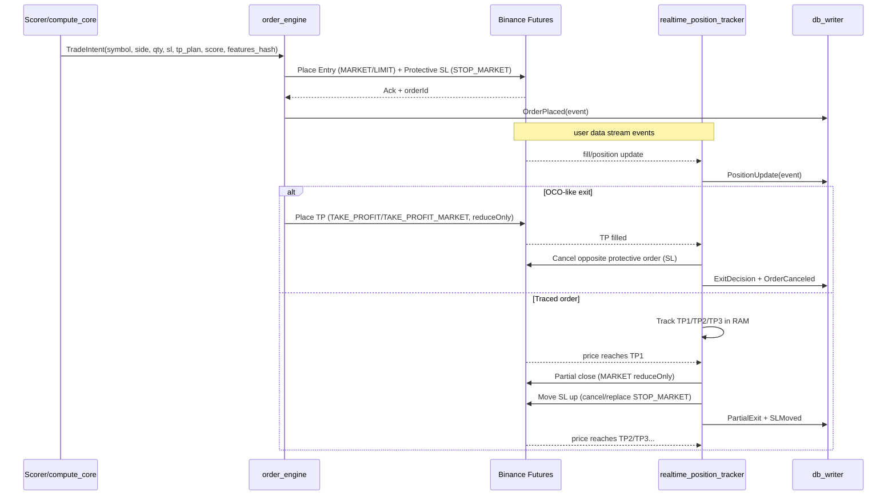

# Trading Bot v1+ (Rust + CUDA + Redpanda + TimescaleDB + ONNX) — Unified Design Document
**Дата:** 2026-01-21  
**Цель:** архитектура и структура проекта “с нуля” под максимально быстрый realtime‑бот для Binance Futures (USDS‑M), с ML‑инференсом (ONNX), хранением данных в TimescaleDB и event‑bus на Redpanda.  
**Железо v1:** 1 сервер (домашний ПК) — 32GB RAM + RTX 3080 Ti.

---

## 0) TL;DR (что будет в конце)
- **Realtime ingest** по ~250 USDT‑парам: 1m/5m/15m/1h — через WS, 4h/1d — polling/on-close.
- **GPU-first bootstrap:** после backfill считаем индикаторы батчем на **CUDA** сразу для **всех 6 TF (1m/5m/15m/1h/4h/1d)**; realtime “хвост” считаем **CPU-инкрементально**, но включаем GPU catch-up при backlog.
- **Две линии обработки**:
  - **Hot Path (RAM + GPU/CPU):** “close event” → индикаторы → raw‑signals → ML → финальный скоринг → trade‑intent.
  - **Cold Path (DB + ML training):** батч‑запись в TimescaleDB, формирование датасета, периодическое переобучение и автодеплой модели.
- **Orders (Futures):**
  - “OCO‑like” (эмуляция через TP/SL conditional orders + авто‑cancel).
  - “Traced order” (TP1/TP2/TP3 в RAM, частичное закрытие, подъем SL).
  - **realtime_position_tracker**: проверяет “валидность” сигнала относительно текущих индикаторов/скоринга и управляет выходом/трейлом.
- **UI v1:** Binance‑like web‑интерфейс: Axum WS + React + TradingView Lightweight Charts, таблицы с виртуализацией.
- **DevOps:** docker-compose + bash scripts с preflight/healthcheck; Prometheus‑метрики и structured‑логи.

---

## 1) Требования и ограничения (зафиксированные)
### Функциональные
1. **Список пар**: хардкод/конфиг список ~250 USDT‑пар.  
2. **TF**: 1m, 5m, 15m, 1h — основная торговля; 4h, 1d — контекст/проверка режима рынка.  
3. **Backfill**: 700 свечей на пару × TF на старте.  
4. **Realtime**: внутри свечи тоже приходят апдейты (intra‑candle).  
5. **Latency**: целевой end‑to‑end ≤ 1 сек от апдейта/close до готового сигнала.
6. **Хранение**: в базе — пары/свечи/индикаторы/сигналы/ордера/позиции; в RAM — только hot state.

### Нефункциональные
- Стабильность: reconnection + догрузка пропусков.
- Ресурсность: не “молотить” GPU на каждый тик; батчить и считать по close.
- Масштаб: 250×4 TF ≈ 1000 kline‑стримов (почти лимит 1024 на соединение) → менеджер подписок обязателен.
- Идемпотентность: at‑least‑once доставку из Redpanda переживаем без дублей в БД.

---

## 2) Ключевые решения по производительности
### 2.1. “Close-driven compute”
**Правило:** intra‑candle update → обновляем только working candle в RAM и (опционально) сверх‑легкие состояния;  
**тяжелое** (GPU/ML/скоринг/DB) → **только на CandleClosed**.  
Это резко снижает нагрузку и IO.

### 2.2. Инкрементальность
Почти все индикаторы должны уметь **update(1 бар)**:
- EMA(20/50/200), SMA, RSI, MACD, ATR, ADX, BB, Stoch, VWAP, OBV…
Тяжелые: SR‑levels / pivot‑cluster / alligator — считаем реже или батчами.

### 2.3. Батчинг и zero-allocation
- Bounded queues + backpressure.
- Пулы объектов (slab/smallvec), кольцевые буферы на бары.
- Zero-copy сериализация для событий/фичей (rkyv / simd-json).
- Pinned memory / pre-compiled PTX для GPU.

### 2.4. GPU-first по умолчанию (bootstrap/backfill)
По умолчанию **CUDA — основной путь** расчёта индикаторов при первичной загрузке истории и догрузках:
- Скачали историю (700 баров) по всем **6 TF** (1m…1d) → формируем батчи → считаем индикаторы на GPU → пишем результаты.
- CPU используется как fallback (если GPU недоступна) и как “хвост” в realtime (инкрементальные апдейты).

Практический смысл: backfill — это “bulk workload”, где GPU выигрывает **при правильном батчинге** и минимизации копирований CPU→GPU.

### 2.5. GpuPlanner (планировщик GPU/CPU)
`GpuPlanner` — модуль в `compute_core`, который принимает jobs и выбирает исполнителя (GPU/CPU), управляя очередями и backpressure.

**Job types**
- `BOOTSTRAP_BATCH`: первичный расчёт индикаторов по истории (GPU).
- `GAPFILL_BATCH`: догрузка пропусков после reconnect (GPU).
- `REALTIME_CLOSE`: один закрытый бар (CPU incremental по умолчанию).
- `HEAVY_RECALC`: тяжёлые блоки (SR-levels / pivot cluster) по расписанию (GPU).

**Default mapping**
- Bootstrap / Gapfill / Heavy → **GPU**
- Realtime close → **CPU incremental**

**Auto-switch (GPU catch-up)**
GpuPlanner переключает realtime на GPU, если:
- backlog jobs > `gpu_catchup_min_jobs`
- либо наблюдаемая latency по close > `realtime_cpu_max_latency_ms`
- либо включены тяжёлые индикаторы/режимы (например SR-levels “точный” пересчёт)

**Ключевые параметры (config)**
- `gpu_batch_symbols = 32..64` (сколько символов в одном GPU батче)
- `gpu_batch_window = 700` (bootstrap) / `=N` (gapfill)
- `gpu_catchup_min_jobs = 200` (минимум накопившихся close для включения GPU)
- `realtime_cpu_max_latency_ms = 400` (порог “CPU не успевает”)
- `gpu_queue_max = 5000` (bounded)
- `gpu_streams = 2..4` (CUDA streams)
- `gpu_pinned_buffers = true`

### 2.6. Warmup gates (фазы старта до включения торговли)
Торговля (order_engine + position_tracker в режиме “active”) включается **только после** прохождения warmup:

1. `INFRA_READY` — TimescaleDB + Redpanda подняты, миграции применены  
2. `PAIRS_READY` — список пар загружен и подтверждён  
3. `BACKFILL_CANDLES_READY` — history 700 баров загружены по **всем 6 TF**  
4. `BOOTSTRAP_INDICATORS_READY` — индикаторы рассчитаны **GPU batch** по **всем 6 TF**  
5. `MODEL_READY` — ONNX модель загружена, прогон “smoke inference” успешен  
6. `RUN` — scoring включён, разрешены trade_intents и выставление ордеров

**Как это реализуем**
- Каждый сервис отдаёт `GET /stagez` (текущий stage + краткая причина, если stuck).
- `start.sh` ждёт прохождения stage (health-gate), затем включает “RUN mode”.
- Дополнительно stage публикуется в `system.stage` (Redpanda), чтобы сервисы могли синхронизироваться без bash.

---

## 3) Архитектура: сервисы и ответственность
### 3.1. Список сервисов (v1)
1. **market_ingest** (Rust)  
   - WS‑подписки (1m/5m/15m/1h), сбор tick/kline, сборка “working candle”.  
   - REST backfill (700 баров) и REST gap‑fill (если WS рвался).  
   - Публикация событий: CandleClosed, CandleUpdateLite (опционально), Health.  

2. **compute_core** (Rust + CUDA, GPU-first)  
   - Хранит hot state по барам/индикаторам в RAM (ring buffers + incremental states).  
   - **GpuPlanner** управляет вычислениями: bootstrap/gapfill/heavy → GPU, realtime close → CPU incremental (с GPU catch-up при backlog).  
   - **Bootstrap:** после backfill запускает **GPU batch расчёт индикаторов по всем 6 TF (1m/5m/15m/1h/4h/1d)** и пишет результат в outbox.  
   - **Realtime:** на CandleClosed обновляет инкрементные состояния (CPU), затем raw signals → prefilter → ML inference → final scoring.  
   - Публикация: IndicatorsComputed, SignalCandidate, TradeIntent, Stage(BOOTSTRAP_INDICATORS_READY).

3. **db_writer** (Rust)  
   - Подписка на топики outbox (candles/indicators/signals/orders/positions).  
   - “Пакетная” запись (COPY/батчи), идемпотентность (unique keys).  
   - Retention + compression policy init.

4. **order_engine** (Rust)  
   - Управление ордерами Futures: entry + TP/SL (OCO‑like), traced orders.  
   - Подписка на TradeIntent.  
   - Отправка ордеров через REST/Websocket API, контроль ошибок, retry/backoff.  
   - Публикация: OrderPlaced/OrderFilled/OrderCanceled/OrderFailed.

5. **realtime_position_tracker** (Rust)  
   - User data stream (fills, position updates).  
   - Переоценка текущей позиции: сравнение “стартовых” фичей/скоринга vs текущих.  
   - Управление traced TP1/TP2/TP3 и динамическим SL (trailing/step-up).  
   - Публикация: PositionUpdate, RiskEvent, ExitDecision.

6. **api_gateway** (Rust, Axum)  
   - REST: пары, последние свечи, сигналы, позиции, настройки.  
   - WS: стрим в UI (candles/indicators/signals/positions).  
   - /healthz, /readyz, /metrics.

7. **ml_trainer** (Python, optional container)  
   - Периодическое обучение/валидация, экспорт в ONNX, запись артефактов, “атомарный” деплой модели.

> MVP можно стартовать без order_engine/position_tracker, но ты просишь сразу заложить — значит в структуре они есть, а включение фич — флагами.

---

## 4) Потоки данных и процессные диаграммы

### 4.1. Главный pipeline (данные → сигнал → запись)
```mermaid
flowchart LR
  A[Start: load pairs list] --> B[DB: upsert pairs]
  B --> C[Backfill REST: 700 bars x TF]
  C --> D[Outbox: CandlesBatch]
  B --> E[WS Manager: subscribe 1m/5m/15m/1h]
  E --> F[Working Candle RAM]
  F -->|intra-update| G[Lite state update]
  F -->|candle close| H[CandleClosed Event]
  H --> I[Indicators Engine (incremental/batched)]
  I --> J[Raw Signal Engine (per-indicator score)]
  J --> K[Pre-filter (threshold per indicator)]
  K --> L[ML Inference (ONNX Runtime)]
  L --> M[Final Scorer]
  M -->|score >= 0.97| N[TradeIntent]
  I --> O[Indicators Outbox]
  N --> P[Redpanda Topics]
  O --> P
  D --> P
  P --> Q[DB Writer (batch + idempotent)]
  Q --> R[(TimescaleDB)]
```

### 4.1.1. Bootstrap/backfill (GPU-first для всех 6 TF)
```mermaid
flowchart LR
  A[PairsReady] --> B[REST Backfill: 700 bars x 6 TF]
  B --> C[Batch Buffers (SoA arrays in RAM)]
  C --> D[GpuPlanner: BOOTSTRAP_BATCH -> GPU]
  D --> E[CUDA Kernels: indicators + derived features]
  E --> F[Outbox: indicators.closed + features.snapshot]
  B --> G[Outbox: candles.closed (bulk)]
  F --> H[Redpanda]
  G --> H
  H --> I[DB Writer: COPY -> merge/idempotent upsert]
  I --> J[(TimescaleDB)]
```

### 4.1.2. Realtime tail (CPU incremental + GPU catch-up при backlog)
```mermaid
flowchart LR
  A[WS kline updates] --> B[Working candle RAM]
  B -->|close| C[CandleClosed]
  C --> D[GpuPlanner: REALTIME_CLOSE -> CPU incremental]
  D --> E[Indicators update(1)]
  E --> F[Raw signals -> prefilter -> ML -> scorer]
  F -->|score>=0.97| G[TradeIntent]
  E --> H[Outbox indicators.closed]
  G --> I[Redpanda]
  H --> I
  I --> J[DB Writer batch]
  C --> K{backlog/latency high?}
  K -->|yes| L[GpuPlanner: GPU catch-up batch]
  L --> E
```


### 4.2. Ордерный pipeline (TradeIntent → позиция → выход)


### 4.3. Startup / health gates (что проверяем перед “RUN”)
```mermaid
flowchart TD
  A[preflight: disk/ports/env] --> B[GPU check: nvidia-smi + CUDA runtime]
  B --> C[docker compose up]
  C --> D[wait: timescaledb ready]
  D --> E[migrations + hypertables + policies]
  E --> F[wait: redpanda ready + topics]
  F --> G[start core services: market_ingest + compute_core + db_writer]
  G --> H[wait stage: BACKFILL_CANDLES_READY (all 6 TF)]
  H --> I[wait stage: BOOTSTRAP_INDICATORS_READY (GPU batch all 6 TF)]
  I --> J[wait stage: MODEL_READY (smoke inference)]
  J --> K[enable RUN: scorer + order_engine + position_tracker active]
  K --> L[health gate: /readyz all services]
  L --> M[RUN mode]
```

---

## 5) Ingest: WS/REST стратегия и дедупликация
### 5.1. WS подписки и лимиты
- Realtime WS **только**: 1m/5m/15m/1h, чтобы уложиться в ~1024 streams на 1 соединение.
- 4h/1d (и при желании 4h) — polling раз в N минут или on-close REST.

### 5.2. Working candle в RAM
Для каждой пары×TF держим:
- `working: CandleMutable` (open/high/low/close/volume, start_time, event_time, is_closed=false)
- `last_closed_time`
- `ring_closed: RingBuffer<Candle>` (последние N закрытых)

**Правило записи:**
- Внутри свечи: **не пишем** в БД; только обновляем working.
- На close: публикуем CandleClosed с полной свечой.

### 5.3. Gap-fill (если WS рвался)
Алгоритм:
1. При reconnect: для каждого symbol×TF берём `last_closed_time` из RAM/DB.
2. REST `klines` от `last_closed_time` до now (с лимитом), batch‑insert.
3. Только после догрузки — снова включаем “live” режим.

---

## 6) Compute Core: индикаторы, сырые сигналы, скоринг, ML
### 6.1. Сортировка индикаторов по значимости (v1)
**Tier 0 (обязательные, быстрые, дают основу):**
- EMA20/50/200
- RSI
- MACD
- ATR
- ADX
- Bollinger Bands
- Stochastic
- Trend (simple: ema50 vs ema200 + slope)
- Volume Spike (z-score/rolling)
- VWAP (если есть данные, зависит от источника)

**Tier 1 (усиливают фильтрацию):**
- SMA
- CCI
- Williams %R
- OBV
- Alligator (можно CPU)

**Tier 2 (тяжелые/реже):**
- Support/Resistance levels (pivot+cluster+strength)
- Любые “market structure” / pattern detectors
- Correlation/regime helpers

### 6.2. Инкрементные состояния (пример)
Для каждого symbol×TF хранится `IndicatorState`:
- `ema20, ema50, ema200` + alpha
- `rsi_avg_gain, rsi_avg_loss`
- `macd_fast_ema, macd_slow_ema, macd_signal_ema`
- `atr_wilder`
- `adx_state` (dm+, dm-, tr, smooth)
- `bb_mean, bb_var` (rolling/ewm)
- `stoch_state`
- `vwap_cum_pv, vwap_cum_v`
- `obv_last`

Эти состояния обновляются **только** на CandleClosed.

### 6.3. GPU стратегия
- GPU выгодна на **батчах**: “матрица” `[#symbols * #TF, window]`.
- Перенос в VRAM:
  - либо массивы closes/high/low/volume
  - либо уже подготовленные фичи (returns, tp, etc)
- CUDA ядра: считаем несколько индикаторов “за один проход” максимально переиспользуя память.
- Используем pinned memory + async memcpy + stream’ы.
- Kernels компилируем заранее (PTX) и грузим при старте.

### 6.4. Pre-filter (до ML)
На уровне каждого индикатора выдаём `raw_score ∈ [0..1]`:
- если `raw_score < indicator_threshold` → выкидываем и не несём дальше.
- оставшиеся превращаем в компактный feature vector.

Это снижает загрузку ML и скорера.

### 6.5. ML inference (ONNX)
- В compute_core: `ModelManager` держит 1–2 модели (почему 2: ансамбль/каллибровка).
- Инференс батчами по событиям закрытия (например пачка из 250×4 = 1000 точек).
- Выход:
  - `prob_breakout` (вероятность пробоя SR / продолжения импульса)
  - `expected_move` (ожидаемая амплитуда/квантиль)

### 6.6. Финальный скоринг
`final_score = f(raw_scores, ml_outputs, regime_boost, risk_penalty, liquidity_penalty, latency_penalty)`
- `final_score >= 0.97` → TradeIntent
- ниже → логируем в signals_log для обучения (если нужно), но не торгуем.

---

## 7) Order subsystem (Binance Futures) — OCO-like + Traced
> В Futures OCO “как на споте” обычно отсутствует как единый связанный тип; поэтому проектируем **связку** из нескольких conditional orders + слежение за исполнением и отменой.

### 7.1. Вариант A: “OCO-like” (брекет)
**Идея:** после входа ставим SL и TP как отдельные ордера (reduceOnly / closePosition), и на fill одного — отменяем другой.

Компоненты:
- `order_engine::oco::OcoManager`
- `realtime_position_tracker::fills::FillRouter`
- `order_engine::cancel_replace` (cancel+replace SL для трейла)

Особенности:
- корректно учитывать `positionSide` (ONE-WAY vs HEDGE).
- обязательный `reduceOnly` для защитных ордеров, чтобы не открыть “противоположную” позицию.

### 7.2. Вариант B: Traced order (TP план в RAM)
**Идея:** на биржу ставим только:
- entry
- SL (STOP_MARKET/STOP)

TP‑план живёт в RAM: `[tp1, tp2, tp3]`, доли закрытия `[p1,p2,p3]`.

Логика:
- цена дошла до TP1 → частично закрываем, SL поднимаем (step‑up), ждём TP2
- дошла до TP2 → снова частично закрываем, снова SL вверх
- TP3 → закрываем остаток или переводим в “runner” (опционально)

Риски/тонкости:
- нужно учитывать проскальзывание и комиссию.
- при лаге/разрыве user data stream — сверяем позицию через REST.

### 7.3. realtime_position_tracker (то, что ты просишь)
**Основная задача:** держать “актуальность” сигнала:
- входили с `score=0.992` и признаками X
- сейчас прошло N минут, индикаторы/режим изменились → сигнал деградировал
- решение: закрыть (или подтянуть SL / увеличить TP / уменьшить риск)

Входы:
- `PositionOpened` + snapshot фичей на момент входа
- текущие `IndicatorsComputed` + рынок (mark price, funding, open interest — если добавим)
- события `OrderFilled` / `LiquidationRisk` / `MarginRatio`

Выходы:
- `ExitDecision`: close now / tighten SL / trail / scale out / extend TP
- команды в order_engine: cancel/replace, market reduce-only close

### 7.4. Risk / Safety (без этого фьючи убьют депозит)
- Hard kill switch: max daily loss, max open positions, max leverage, max notional.
- Circuit breakers: отключить торговлю если:
  - WS нестабилен
  - DB lag > threshold
  - latency > threshold
  - spread/volatility > threshold
- “Cool down” после серии стопов.

---

## 8) Storage: TimescaleDB схема под твои задачи
### 8.1. Принципы
- Все time-series — hypertable.
- Primary key: (symbol_id, tf, time).
- Индикаторы и сигналы — write-on-close.
- Сырые тики в v1 не храним (слишком шумно). Если надо — отдельная таблица/паркет.

### 8.2. Таблицы (минимум)
#### 8.2.1. pairs
- `id bigserial pk`
- `symbol text unique`
- `is_active bool`
- `meta jsonb` (stepSize, tickSize, minNotional, etc)

#### 8.2.2. candles (hypertable)
- `time timestamptz not null`
- `symbol_id bigint not null`
- `tf smallint not null` (enum-like: 1m=1, 5m=5, 15m=15, 1h=60, 4h=240, 1d=1440)
- `open, high, low, close float8`
- `volume float8`
- `is_final bool default true`
Constraints:
- `primary key(symbol_id, tf, time)`

Indexes:
- `(symbol_id, tf, time desc)` (покрывает most queries)

Timescale:
- `create_hypertable('candles','time', partitioning_column=>'symbol_id', number_partitions=>8)`

Compression:
- segment by `symbol_id, tf`
- order by `time`

Retention:
- по времени (привязано к bar-count):
  - 1m: ~2–4 дня
  - 5m: ~7–14 дней
  - 15m: ~30–45 дней
  - 1h: ~120 дней
  - 4h: ~400 дней
  - 1d: 2 года

#### 8.2.3. indicators (hypertable)
- `time`, `symbol_id`, `tf`
- `ema20, ema50, ema200 float4`
- `rsi float4`
- `macd, macd_signal, macd_hist float4`
- `atr, adx float4`
- `bb_up, bb_mid, bb_low float4`
- `stoch_k, stoch_d float4`
- (остальные — по мере необходимости)
- `features_hash uuid` (хэш набора фичей/версии формулы)
PK: `(symbol_id, tf, time)`

#### 8.2.4. signals (hypertable)
- `time`, `symbol_id`, `tf`
- `side smallint` (1 long, -1 short)
- `final_score float4`
- `ml_score float4`
- `heur_score float4`
- `reason jsonb` (топ-фичи/объяснение)
- `model_version text`
- `signal_id uuid` (idempotency key)
Unique: `signal_id`

#### 8.2.5. orders / positions / trades
- `orders` (append-only log + current state)
- `positions` (current + history snapshots)
- `trades` (fills)

### 8.3. Быстрая запись (db_writer)
Паттерн:
1. Сервисы пишут в Redpanda **outbox** (батчами) или напрямую через bounded channel в db_writer.
2. db_writer:
   - собирает пачку (например 1000–5000 строк)
   - `COPY` в staging table
   - `INSERT INTO target ... ON CONFLICT DO NOTHING/UPDATE`
3. Для “close candle” можно выбрать `DO NOTHING` (если idempotent ключ гарантирует уникальность) или `DO UPDATE` (если possible rewrite).

---

## 9) Redpanda: топики и контракты
### 9.1. Минимальные топики
- `candles.closed` (ключ: symbol_id|tf|time)
- `indicators.closed`
- `signals.candidates`
- `signals.trade_intents`
- `orders.events`
- `positions.events`
- `system.health`
- `system.metrics` (если не через Prometheus напрямую)

### 9.2. Схема сообщений
Для скорости:
- бинарная схема (rkyv / flatbuffers / protobuf) + версионирование.
- ключ сообщения = идемпотентный ключ записи в БД.

---

## 10) Web UI (Binance-like) — без лишней тяжести
### 10.1. Технологии
- Backend: **Axum** (api_gateway)
- Transport: WebSocket (candles/signals/positions), REST для справочников
- Frontend: React + TypeScript
- Charts: TradingView Lightweight Charts
- Table virtualization: react-virtual / tanstack-virtual
- State: Zustand

### 10.2. Экран v1
- Слева: список пар (поиск, избранное)
- Центр: график (1m/5m/15m/1h), оверлеи EMA/BB/SR, маркеры сигналов
- Справа: “Signals feed” + “Open positions”
- Панель сверху: режим стратегии/фильтры/риски/пауза торговли

---

## 11) Observability и диагностика
### 11.1. Метрики (Prometheus)
- ingest:
  - ws_connected, ws_reconnects, ws_msg_rate
  - candle_close_latency_ms
- compute:
  - indicator_batch_ms, gpu_kernel_ms, ml_infer_ms
  - signals_generated, signals_filtered
- db:
  - db_batch_rows, db_flush_ms, db_lag_seconds
- orders:
  - order_latency_ms, cancel_replace_ms, slippage_estimate
- system:
  - ram_bytes, gpu_mem_bytes, cpu_load, disk_free

### 11.2. Health endpoints
Каждый сервис:
- `GET /healthz` (процесс жив)
- `GET /readyz` (зависимости доступны: WS/DB/Redpanda/GPU/Model)
- `GET /metrics`

---

## 12) Bash scripts (start/stop/restart/healthcheck) + health-gates
> Скрипты ниже — каркас. В проекте будут в `scripts/`.

### 12.1. scripts/start.sh (с warmup gates)
```bash
#!/usr/bin/env bash
set -euo pipefail

ROOT="$(cd "$(dirname "${BASH_SOURCE[0]}")/.." && pwd)"

echo "🔍 Preflight..."
"$ROOT/scripts/preflight.sh"

echo "🐳 docker-compose up (infra)..."
docker compose -f "$ROOT/infra/docker-compose.yml" up -d --remove-orphans timescaledb redpanda

echo "⏳ Waiting for TimescaleDB..."
"$ROOT/scripts/wait_pg.sh"

echo "🗄️  Running migrations / hypertables / policies..."
docker compose -f "$ROOT/infra/docker-compose.yml" run --rm migrations

echo "🐟 Waiting for Redpanda..."
"$ROOT/scripts/wait_redpanda.sh"

echo "🧱 Creating topics..."
docker compose -f "$ROOT/infra/docker-compose.yml" run --rm rp_init

echo "🚀 Starting core services (ingest/compute/db)..."
docker compose -f "$ROOT/infra/docker-compose.yml" up -d market_ingest compute_core db_writer

echo "✅ Warmup gate #1: BACKFILL_CANDLES_READY (all 6 TF)"
"$ROOT/scripts/wait_stage.sh" "http://localhost:8081/stagez" "BACKFILL_CANDLES_READY" 1800

echo "✅ Warmup gate #2: BOOTSTRAP_INDICATORS_READY (GPU batch all 6 TF)"
"$ROOT/scripts/wait_stage.sh" "http://localhost:8082/stagez" "BOOTSTRAP_INDICATORS_READY" 1800

echo "✅ Warmup gate #3: MODEL_READY"
"$ROOT/scripts/wait_stage.sh" "http://localhost:8082/stagez" "MODEL_READY" 300

echo "🚀 Starting API + Orders (RUN enabled)"
docker compose -f "$ROOT/infra/docker-compose.yml" up -d api_gateway order_engine position_tracker

echo "✅ Health gate..."
"$ROOT/scripts/healthcheck.sh" --wait

echo "🎉 RUNNING"
```

### 12.2. scripts/healthcheck.sh
```bash
#!/usr/bin/env bash
set -euo pipefail

WAIT=0
if [[ "${1:-}" == "--wait" ]]; then WAIT=1; fi

check_url () {
  local name="$1" url="$2"
  curl -fsS "$url" >/dev/null && echo "✅ $name" || (echo "❌ $name" && return 1)
}

check_pg () {
  docker compose -f infra/docker-compose.yml exec -T timescaledb pg_isready -U postgres >/dev/null
}

check_redpanda () {
  docker compose -f infra/docker-compose.yml exec -T redpanda rpk cluster health >/dev/null
}

check_gpu () {
  command -v nvidia-smi >/dev/null && nvidia-smi -L >/dev/null
}

try_once () {
  echo "== system checks =="
  check_gpu && echo "✅ GPU" || (echo "❌ GPU"; return 1)
  check_pg && echo "✅ Postgres" || (echo "❌ Postgres"; return 1)
  check_redpanda && echo "✅ Redpanda" || (echo "❌ Redpanda"; return 1)

  echo "== service readiness =="
  check_url "api_gateway"     "http://localhost:8080/readyz"
  check_url "market_ingest"   "http://localhost:8081/readyz"
  check_url "compute_core"    "http://localhost:8082/readyz"
  check_url "db_writer"       "http://localhost:8083/readyz"
  check_url "order_engine"    "http://localhost:8084/readyz"
  check_url "position_tracker""http://localhost:8085/readyz"
}

if [[ "$WAIT" -eq 1 ]]; then
  for i in {1..60}; do
    if try_once; then exit 0; fi
    sleep 1
  done
  echo "❌ health gate timeout"
  exit 1
else
  try_once
fi
```


### 12.5. scripts/wait_stage.sh
```bash
#!/usr/bin/env bash
set -euo pipefail

URL="${1:?stagez url}"
TARGET="${2:?target stage}"
TIMEOUT="${3:-600}"

start_ts="$(date +%s)"
while true; do
  stage="$(curl -fsS "$URL" | sed -n 's/.*"stage"[[:space:]]*:[[:space:]]*"\([^"]*\)".*/\1/p' | head -n1 || true)"
  if [[ "$stage" == "$TARGET" ]]; then
    echo "✅ stage reached: $TARGET"
    exit 0
  fi
  now="$(date +%s)"
  if (( now - start_ts > TIMEOUT )); then
    echo "❌ stage timeout. expected=$TARGET got=${stage:-unknown}"
    exit 1
  fi
  sleep 2
done
```

### 12.3. scripts/stop.sh
```bash
#!/usr/bin/env bash
set -euo pipefail
docker compose -f infra/docker-compose.yml down --remove-orphans
```

### 12.4. scripts/restart.sh
```bash
#!/usr/bin/env bash
set -euo pipefail
./scripts/stop.sh
./scripts/start.sh
```

---

## 13) Репозиторий: структура папок и “пустые” файлы
```text
.
├── Cargo.lock
├── Cargo.toml
├── compute
│   ├── health.rs
│   ├── indicators
│   │   ├── adx.rs
│   │   ├── alligator.rs
│   │   ├── atr.rs
│   │   ├── bb.rs
│   │   ├── cci.rs
│   │   ├── ema.rs
│   │   ├── macd.rs
│   │   ├── obv.rs
│   │   ├── poc.rs
│   │   ├── rsi.rs
│   │   ├── sr_levels.rs
│   │   ├── stoch.rs
│   │   ├── trend.rs
│   │   ├── volume_spike.rs
│   │   ├── vwap.rs
│   │   └── williams.rs
│   ├── ml
│   │   ├── features.rs
│   │   ├── model_manager.rs
│   │   ├── mod.rs
│   │   ├── notebooks
│   │   └── trainer
│   │       ├── export_onnx.py
│   │       ├── features.py
│   │       ├── schedule.py
│   │       └── train.py
│   ├── planner
│   │   ├── gpu_planner.rs
│   │   └── mod.rs
│   ├── raw_signals
│   │   ├── mod.rs
│   │   ├── scoring.rs
│   │   └── thresholds.rs
│   ├── scorer
│   │   ├── final_score.rs
│   │   └── mod.rs
│   └── src
│       ├── lib.rs
│       ├── main.rs
│       └── pools.rs
├── config
│   ├── binance.toml
│   ├── compute.toml
│   ├── database.toml
│   ├── runtime.toml
│   ├── rust_bot.toml
│   └── universe.toml
├── crates
│   ├── api_binance
│   │   ├── Cargo.toml
│   │   └── src
│   │       ├── lib.rs
│   │       ├── rate_limits.rs
│   │       ├── rest.rs
│   │       ├── sign.rs
│   │       ├── ws_market.rs
│   │       └── ws_user.rs
│   ├── api_gateway
│   │   ├── Cargo.toml
│   │   └── src
│   │       ├── auth.rs
│   │       ├── health.rs
│   │       ├── main.rs
│   │       ├── routes.rs
│   │       └── ws.rs
│   ├── common
│   │   ├── Cargo.toml
│   │   └── src
│   │       ├── config.rs
│   │       ├── enums.rs
│   │       ├── error.rs
│   │       ├── lib.rs
│   │       ├── serde.rs
│   │       ├── timeframe.rs
│   │       └── types.rs
│   ├── db_init
│   │   ├── Cargo.toml
│   │   └── src
│   │       └── main.rs
│   └── db_writer
│       ├── Cargo.toml
│       └── src
│           ├── batcher.rs
│           ├── copy_row.rs
│           ├── copy.rs
│           ├── health.rs
│           ├── idempotency.rs
│           ├── lib.rs
│           ├── main.rs
│           ├── messages.rs
│           ├── migrations.rs
│           └── retention.rs
├── cuda
│   ├── build.rs
│   ├── kernels
│   │   ├── indicators.cu
│   │   └── reduce.cu
│   └── ptx
│       └── indicators.ptx
├── docs
│   └── TradingBot_DesignDoc_Unified.md
├── infra
│   ├── database
│   │   └── init
│   │       ├── 001_extensions_and_schemas.sql
│   │       ├── 010_market_core.sql
│   │       ├── 020_market_candles_tf.sql
│   │       ├── 025_market_staging.sql
│   │       ├── 030_market_indicators_tf.sql
│   │       ├── 040_market_raw_signals.sql
│   │       ├── 050_trade_tables.sql
│   │       ├── 055_constraints.sql
│   │       ├── 060_policies.sql
│   │       ├── 070_views_all.sql
│   │       └── 080_health_queries.sql
│   └── docker-compose.yaml
├── ingest
│   ├── Cargo.toml
│   └── src
│       ├── backfill.rs
│       ├── candle_builder.rs
│       ├── config.rs
│       ├── gap_fill.rs
│       ├── health.rs
│       ├── lib.rs
│       ├── main.rs
│       ├── universe.rs
│       └── ws_manager.rs
├── logs
│   ├── db_health.log
│   ├── db_init.log
│   ├── db_writer.log
│   └── ingest.log
├── order_engine
│   └── src
│       ├── binance_exec.rs
│       ├── health.rs
│       ├── lib.rs
│       ├── main.rs
│       ├── oco
│       │   ├── bracket.rs
│       │   └── mod.rs
│       ├── risk
│       │   ├── breakers.rs
│       │   ├── limits.rs
│       │   └── mod.rs
│       ├── sl_manager.rs
│       ├── tp_manager.rs
│       └── traced
│           ├── mod.rs
│           └── tp_plan.rs
├── position_tracker
│   └── src
│       ├── health.rs
│       ├── lib.rs
│       ├── main.rs
│       ├── reconcile.rs
│       └── tracker.rs
├── project_structure.md
├── reader.py
├── README.md
├── redpanda
│   └── topics.sh
├── run
│   ├── db_writer.pid
│   └── ingest.pid
├── rust_bot.txt
├── rust-toolchain.toml
├── scripts
│   ├── db_health.sh
│   ├── healthcheck.sh
│   ├── preflight.sh
│   ├── restart.sh
│   ├── start.sh
│   ├── stop.sh
│   ├── wait_pg.sh
│   ├── wait_redpanda.sh
│   └── wait_stage.sh
├── strategies
└── webui
    ├── package.json
    └── src
```

---

## 14) ML: какие модели добавить кроме “предиктора пробоя”
Твоя базовая ML‑модель (prob_breakout + expected_move) — ок. Но реально “круто” становится, когда ML помогает не только входу, а **управлению позицией и риском**:

1. **Volatility / ATR forecaster (регрессия/квантили)**  
   Цель: прогноз волатильности на ближайшие N баров → динамика SL/TP и размера позиции.

2. **Regime classifier (классификация режима рынка)**  
   Bull/Bear/Range + high/low vol → включать/выключать стратегии и менять пороги скоринга.

3. **TP/SL optimizer (quantile regression / survival model)**  
   Прогноз распределения “куда дойдет цена раньше: TP или SL” по уровням.  
   Это напрямую улучшает traced‑логику.

4. **Funding / liquidation risk model** (если торгуешь фьючи с плечом)  
   Прогноз “вредного” финансирования/риска ликвидации при данной воле/плече.

5. **Execution/slippage model**  
   Оценка ожидаемого проскальзывания (по ликвидности/объему/спреду) → фильтр сигналов.

6. **Anomaly detector (pump/dump, news shock)**  
   Детектор аномалий по объему/движению → запрет торговли или отдельная “event boost” стратегия.

7. **Meta-model для калибровки скоринга**  
   Модель, которая берет raw+ml и возвращает “calibrated probability of success”, чтобы порог 0.97 был “реальным”.

---

## 15) Фишки, которые делают продукт “взрослым”
- **Paper trading mode** (обязателен): тот же pipeline, но ордера “виртуальные”.
- **Backtest + walk-forward**: для каждой стратегии/параметров.
- **Data quality layer**: дедупликация, пропуски, проверки OHLCV.
- **Model registry**: версии модели, метрики, кто/когда задеплоил.
- **Drift detection**: если распределение фич уплыло — алерт/пауза.
- **Event sourcing для ордеров**: чтобы любой баг воспроизводился по логам.
- **Feature flags**: включать/выключать GPU, индикаторы, стратегии.
- **Dynamic universe** (позже): список пар не только хардкод, но и авто‑фильтр по ликвидности/волатильности.
- **Global context**: BTC dominance/market cap/индексы; это “буст” или фильтр.

---

## 16) План реализации (чтобы не утонуть)
1) Ingest + DB writer (candles only)  
2) Working candle + close events + gap-fill  
3) CPU incremental indicators Tier0  
4) Raw signals + prefilter + final score  
5) ML inference ONNX + model hot-swap  
6) Orders MVP: entry + SL/TP + cancel-on-fill  
7) position_tracker + traced TP plan  
8) SR-levels heavy module + ML breakout integration  
9) UI v1 (candles + signals + positions)  
10) Trainer container + scheduled retrain

---

## 17) Приложение: конфиги
- `config/pairs.toml`: список пар
- `config/runtime.toml`: пороги, TF, лимиты
- `config/risk.toml`: max leverage, max loss, etc
- `config/ml.toml`: модель, batch size, feature set version

---

## 18) Честные риски (важно)
- Фьючерсы с плечом: без железного risk-layer и kill-switch “вопрос времени”, когда депозит ловит серию стопов или ликвидацию.
- “Online learning” в реальном времени почти всегда упирается в качество лейблов (результат сделки узнается позже). Поэтому v1: **онлайн инференс + периодическое обучение**.

---

**Конец документа.**
