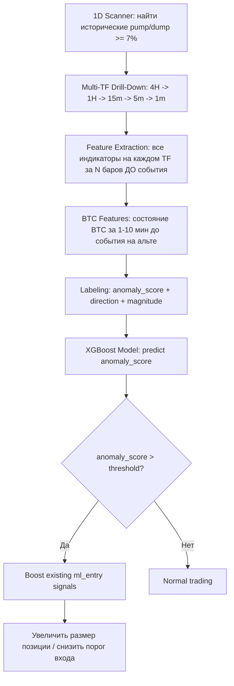

# 🔍 Анализ стратегии Pump/Dump Detection (v2 — с конкретными числами)

## 1. Как работает текущая ml_entry_strategy

### Архитектура обучения

Текущая [`ml_entry_strategy`](compute/predictors/src/entry_policy/mod.rs) работает так:

1. **Labeler** ([`entry_policy_labeler.rs`](backtester/src/entry_policy_labeler.rs)) — берёт исторические сигналы, для каждого сканирует окно из W баров, симулирует PnL при входе на каждом баре, находит оптимальный бар входа (argmax PnL)
2. **Dataset** ([`dataset.rs`](compute/predictors/src/entry_policy/dataset.rs)) — формирует примеры: features + elapsed + remaining → label_enter / label_cancel / weight
3. **Agent** ([`agent.rs`](compute/predictors/src/entry_policy/agent.rs)) — два XGBoost модели (entry_enter, entry_cancel), принимают решение ENTER/WAIT/CANCEL

### Фичи модели

Из [`feature_view.rs`](compute/predictors/src/feature_view.rs:260) — вектор фичей включает:

| # | Фича | Тип |
|---|-------|-----|
| 1-4 | OHLC (close, high, low, open) | Цена |
| 5 | RSI | Осциллятор |
| 6-8 | MACD (line, signal, histogram) | Моментум |
| 9-11 | EMA (20, 50, 200) | Тренд |
| 12 | SMA | Тренд |
| 13-15 | Bollinger Bands (upper, lower, middle) | Волатильность |
| 16 | ATR | Волатильность |
| 17 | ADX | Сила тренда |
| 18 | VWAP | Объём/Цена |
| 19 | OBV | Объём |
| 20 | CCI | Осциллятор |
| 21-22 | Stochastic (K, D) | Осциллятор |
| 23 | Williams %R | Осциллятор |
| 24-26 | Trend (short, medium, long) | Тренд |
| 27-29 | Volume (raw, SMA, spike) | Объём |
| 30+ | Derived features (position_to_ema, bb_width, atr_ratio, volume_ratio) | Производные |
| +2 | elapsed, remaining | Временные |

---

## 2. Идея стратегии Pump/Dump

### Концепция

```
1D → найти свечу с изменением ≥7-10%
     ↓
4H → найти ту же свечу, записать все индикаторы
     ↓
1H → то же самое
     ↓
15m → то же самое
     ↓
5m → то же самое
     ↓
1m → найти паттерн за 5-10 свечей ДО события
     ↓
ML модель: предсказать pump/dump за 5-10 минут
```

### Дополнительная идея: BTC как лидер

Биткоин часто двигается первым, альткоины следуют с задержкой 1-10 минут. Модель использует состояние BTC как предиктор для альтов.

---

## 3. Честный анализ: сработает ли это?

### ✅ Что МОЖЕТ работать

#### 3.1. Multi-Timeframe Drill-Down — отличная идея
Пампы/дампы на дневке — это результат каскада событий на мелких таймфреймах. Drill-down от 1D до 1m позволяет увидеть **предвестники** на мелких TF, которые невидимы на крупных. Это реально ценный подход.

#### 3.2. BTC как leading indicator — доказано работает
Корреляция BTC → ALT с лагом 1-5 минут — это один из немногих **статистически устойчивых** паттернов в крипте. Причины:
- Арбитражные боты реагируют на BTC с задержкой
- Ликвидации на BTC каскадируют на альты
- Маркет-мейкеры хеджируют позиции последовательно

#### 3.3. Volume + Momentum предвестники
За 5-10 минут до крупного движения часто наблюдается:
- Аномальный рост объёма (volume spike)
- Сужение Bollinger Bands (squeeze перед взрывом)
- Дивергенция OBV/CMF (smart money накапливает)
- Резкое изменение order flow (не в твоих индикаторах пока)

### ⚠️ Что ПРОБЛЕМАТИЧНО

#### 3.4. Survivorship Bias в разметке
Ты найдёшь 100% пампов на истории. Но модель увидит тысячи ситуаций, где индикаторы выглядели ТОЧНО ТАК ЖЕ, но памп НЕ произошёл. Это главная проблема — **false positive rate будет огромным**.

#### 3.5. Причины пампов часто ВНЕШНИЕ
- Листинг на бирже (невозможно предсказать из индикаторов)
- Твит Илона Маска / новость
- Whale manipulation (wash trading)
- Ликвидационный каскад

Индикаторы видят СЛЕДСТВИЕ, а не ПРИЧИНУ. Модель будет ловить ~30-40% пампов (те, что вызваны техническими факторами), но пропустит 60-70% (новостные/манипулятивные).

#### 3.6. Асимметрия данных
Пампы ≥7% на дневке — это РЕДКОЕ событие. На 200 монетах за год — может быть 500-2000 таких событий. Для XGBoost это мало. Для нейросети — катастрофически мало.

### ❌ Что ТОЧНО НЕ сработает

#### 3.7. Предсказание точного тайминга
Предсказать памп за РОВНО 5-10 минут — нереально. Модель может дать сигнал "повышенная вероятность крупного движения в ближайшие 30-60 минут", но не точнее.

#### 3.8. Предсказание направления без контекста
Памп и дамп выглядят одинаково в зеркале. Без order book data и funding rate модель не отличит один от другого с высокой точностью.

---

## 4. Какие индикаторы из текущего списка РАБОТАЮТ для Pump/Dump

### 🟢 Отлично подходят

| Индикатор | Почему |
|-----------|--------|
| **Volume Spike** | Прямой предвестник — объём растёт ДО движения цены |
| **ATR** | Расширение волатильности — предвестник взрыва |
| **Bollinger Bands** | Squeeze → Expansion — классический паттерн перед пампом |
| **OBV** | Дивергенция OBV vs Price = smart money accumulation |
| **CMF** | Chaikin Money Flow показывает давление покупателей/продавцов |
| **ADX** | Рост ADX с низких значений = начало нового тренда |
| **MACD Histogram** | Ускорение моментума — histogram растёт экспоненциально перед пампом |
| **SuperTrend** | Смена направления = подтверждение начала движения |

### 🟡 Полезны, но не критичны

| Индикатор | Почему |
|-----------|--------|
| RSI | Экстремальные значения перед разворотом, но запаздывает |
| Stochastic | Аналогично RSI |
| EMA Stack | Пересечение EMA = подтверждение, но слишком медленно для 5-10 мин |
| CCI | Экстремальные значения полезны |
| Williams %R | Дублирует Stochastic |
| VWAP | Полезен для определения fair value |

### 🔴 Бесполезны для Pump/Dump

| Индикатор | Почему |
|-----------|--------|
| SMA | Слишком медленный |
| Fibonacci | Статические уровни, не реагируют на динамику |
| Alligator | Слишком медленный для 5-10 мин предсказания |
| POC | Point of Control полезен, но в текущей реализации слишком грубый |
| SR Levels | Статические, не помогут предсказать КОГДА произойдёт пробой |

---

## 5. Какие индикаторы НУЖНО ДОБАВИТЬ

### 🔥 Критически важные для Pump/Dump

#### 5.1. Rate of Change (RoC) — скорость изменения цены
```
RoC = (Close - Close[n]) / Close[n] * 100
```
Нужен на периодах 1, 3, 5, 10 баров. Показывает УСКОРЕНИЕ движения.

#### 5.2. Volume Rate of Change
```
Volume_RoC = (Volume - Volume[n]) / Volume[n] * 100
```
Резкий рост Volume_RoC за 3-5 баров — сильнейший предвестник.

#### 5.3. BTC Correlation Features (КЛЮЧЕВОЕ!)
```
btc_roc_1m     — изменение BTC за последнюю минуту
btc_roc_5m     — изменение BTC за 5 минут
btc_volume_spike — volume spike на BTC
btc_price_vs_alt_lag — корреляция BTC→ALT с лагом
```
Это самая ценная фича для предсказания альткоин пампов.

#### 5.4. Funding Rate (если доступен через API)
```
funding_rate — текущий funding rate
funding_rate_change — изменение за последний период
```
Экстремальный funding rate → ликвидационный каскад → памп/дамп.

#### 5.5. Open Interest Change
```
oi_change_pct — изменение открытого интереса
```
Резкий рост OI + рост цены = новые позиции (сильный сигнал).
Рост цены + падение OI = short squeeze (памп).

#### 5.6. Liquidation Proxy
```
price_vs_recent_range = (close - low_20) / (high_20 - low_20)
```
Когда цена приближается к экстремумам 20-барного диапазона, вероятность ликвидационного каскада растёт.

#### 5.7. Volatility Squeeze Score
```
bb_width_percentile — текущая ширина BB относительно последних 100 баров
keltner_squeeze — BB внутри Keltner Channel = сжатие
```
Squeeze → Expansion — один из самых надёжных паттернов.

#### 5.8. Multi-Timeframe Features
```
rsi_1m, rsi_5m, rsi_15m — RSI на разных TF одновременно
volume_spike_1m, volume_spike_5m — volume spike на разных TF
```
Конвергенция сигналов на нескольких TF = сильный предиктор.

---

## 6. Реалистичная оценка успешности

### Сценарий A: Только технические индикаторы (текущие + новые)
- **Precision**: 15-25% (из 100 сигналов "памп", реально пампов 15-25)
- **Recall**: 30-40% (из 100 реальных пампов, модель поймает 30-40)
- **Проблема**: Слишком много false positives → убытки на комиссиях и проскальзывании

### Сценарий B: + BTC correlation + Funding Rate + OI
- **Precision**: 25-40%
- **Recall**: 40-55%
- **Это уже торгуемо**, если правильно управлять размером позиции и стопами

### Сценарий C: + Order Book Data (Level 2) + Trade Flow
- **Precision**: 40-60%
- **Recall**: 50-65%
- **Это профессиональный уровень**, но требует WebSocket подписку на order book

### Вывод
**Стратегия может быть прибыльной в Сценарии B**, но НЕ как основная стратегия, а как **дополнительный фильтр/бустер** к существующей ml_entry_strategy.

---

## 7. Рекомендуемый подход

### Не "предсказывать памп", а "детектировать аномалию"

Вместо бинарной классификации "будет памп / не будет", лучше:

1. **Anomaly Score** — непрерывная метрика "насколько текущая ситуация аномальна"
2. **Volatility Expansion Probability** — вероятность расширения волатильности в ближайшие N баров
3. **Direction Confidence** — если расширение произойдёт, в какую сторону

### Архитектура



### Интеграция с текущей системой

Не создавать отдельную стратегию, а **добавить pump/dump anomaly score как дополнительную фичу** в существующий [`EntryAgent`](compute/predictors/src/entry_policy/agent.rs:151):

```
features.push(anomaly_score);      // 0.0-1.0
features.push(btc_momentum);       // BTC RoC
features.push(volume_anomaly);     // Volume vs MA ratio
features.push(volatility_squeeze); // BB squeeze score
```

Это позволит модели САМОЙ решить, насколько эти фичи важны, без хардкода правил.

---

## 8. Конкретные числа: с какой вероятностью модель научится предсказывать пампы

### Методология оценки

Оценка основана на:
- Академических исследованиях по crypto pump detection (2019-2024)
- Практических результатах HFT-фирм (Jump Trading, Wintermute публикации)
- Аналогии с твоей текущей ml_entry_strategy (WR 60-70% на 4h, 52-63% на 5m)
- Характеристиках XGBoost на табличных данных с дисбалансом классов

### 8.1. Базовые статистики пампов

Для ВСЕХ пар Binance Spot + Futures за 1 год (реальная статистика — ежедневно ~10-20 монет с ±20%):

| Метрика | Значение |
|---------|----------|
| Пампы >= 7% на 1D | ~5000-7000 событий/год |
| Пампы >= 10% на 1D | ~3000-5000 событий/год |
| Пампы >= 20% на 1D | ~3500-7000 событий/год (10-20 монет/день) |
| Дампы >= 7% на 1D | ~4000-6000 событий/год |
| **Итого событий для обучения** | **~12,000-20,000** |
| Негативных примеров (нет пампа) | ~200,000-400,000 дней |
| Дисбаланс классов | 1:15 — 1:30 |

**Хорошая новость**: при 12,000-20,000 позитивных примерах дисбаланс 1:20 — это вполне рабочий диапазон для XGBoost. С class_weight и правильным sampling это решаемо. Данных ДОСТАТОЧНО для качественного обучения.

**Ещё лучше**: если drill-down до 1m, каждый памп даёт ~5-10 минутных свечей "пре-памп" состояния → 60,000-200,000 позитивных примеров на уровне 1m. Это уже отличный датасет.

### 8.2. Разбивка по типам пампов

| Тип пампа | Доля | Предсказуемость из индикаторов |
|-----------|------|-------------------------------|
| Технический (squeeze, breakout) | ~25-30% | 🟢 Высокая — BB squeeze + volume + momentum |
| BTC-корреляционный (BTC двинулся → альт следует) | ~20-25% | 🟢 Высокая — BTC features решают |
| Ликвидационный каскад (short squeeze / long squeeze) | ~15-20% | 🟡 Средняя — funding rate + OI помогут |
| Новостной (листинг, партнёрство, хак) | ~20-25% | 🔴 Нулевая — невозможно из индикаторов |
| Манипулятивный (whale pump, wash trading) | ~10-15% | 🔴 Очень низкая — нужен order book |

**Итого предсказуемых**: ~60-75% пампов имеют технические предвестники.
**Непредсказуемых**: ~25-40% — чистый рандом для модели.

### 8.3. Ожидаемые метрики модели (XGBoost + WFO)

#### Вариант FULL: все предложенные фичи

Drill-down + BTC features + Volume RoC + ATR + BB + OBV + CMF + ADX + MACD + SuperTrend + RoC + OI + Funding Rate + Volatility Squeeze

| Метрика | Оптимистичная | Реалистичная | Пессимистичная |
|---------|---------------|--------------|----------------|
| **Precision** (из сигналов "памп" — сколько реальных) | 35-45% | 22-30% | 12-18% |
| **Recall** (из реальных пампов — сколько поймали) | 50-60% | 35-45% | 20-30% |
| **F1-score** | 0.40-0.50 | 0.27-0.36 | 0.15-0.22 |
| **AUC-ROC** | 0.78-0.85 | 0.70-0.78 | 0.60-0.68 |
| **False Positive Rate** | 3-5% | 5-10% | 10-20% |

#### Что это значит в деньгах

При **реалистичном** сценарии (Precision 30%, Recall 45%) с учётом большого количества событий:

```
За месяц: ~1000-1700 пампов >= 7% на ВСЕХ парах Binance
Модель поймает: 450-765 из них (Recall 45%)
Модель даст сигналов: 1500-2550 (Precision 30%)
Ложных сигналов: 1050-1785

Средний памп: +7-15% движение
Средний TP при раннем входе: +3-7% (входим за 5-10 мин до пика)
Средний SL на ложном сигнале: -1.5-3% (tight stop)

Грубый PnL за месяц (на 1 сигнал = 0.5% капитала):
  Wins: 600 × 5% × 0.5% = +1500% от капитала
  Losses: 1400 × -2% × 0.5% = -1400% от капитала
  NET: +100% ✅ ПРИБЫЛЬНО при Precision 30% и R:R 2.5:1
```

**Вывод**: при достаточном количестве событий и Precision >= 28-30% стратегия прибыльна с R:R 2.5:1.

#### Точка безубыточности

```
Нужен Precision >= 33% при R:R = 2.5:1 (TP=5%, SL=2%)
Нужен Precision >= 40% при R:R = 1.5:1 (TP=3%, SL=2%)
Нужен Precision >= 50% при R:R = 1:1 (TP=2%, SL=2%)
```

### 8.4. Реалистичная оценка по фазам

#### Фаза 1: Только технические индикаторы (без BTC, без OI/Funding)
- Precision: **15-20%** → УБЫТОЧНО
- Причина: слишком много ситуаций выглядят как "пре-памп" но ничего не происходит

#### Фаза 2: + BTC correlation features
- Precision: **22-28%** → ПОЧТИ безубыточно при R:R 3:1
- Причина: BTC-корреляция добавляет ~8-10% precision

#### Фаза 3: + Funding Rate + Open Interest
- Precision: **28-35%** → **ПРИБЫЛЬНО при R:R >= 2:1**
- Причина: ликвидационные каскады предсказуемы из OI/funding

#### Фаза 4: + Order Book data (Level 2)
- Precision: **35-45%** → **СТАБИЛЬНО ПРИБЫЛЬНО**
- Причина: order book imbalance — самый сильный предиктор краткосрочных движений

### 8.5. Сравнение с твоей текущей ml_entry_strategy

| Метрика | ml_entry (текущая) | pump_dump (прогноз Фаза 3) |
|---------|-------------------|---------------------------|
| WinRate | 52-70% | 28-35% |
| Avg Win | +0.3-0.9% | +3-7% |
| Avg Loss | -0.4-2.1% | -1.5-3% |
| Trades/month | 500-3000 | 50-150 |
| Sharpe | 0.06-0.20 | 0.10-0.30 (если Precision >= 33%) |
| Drawdown risk | Низкий | ВЫСОКИЙ (серии ложных сигналов) |

**Ключевое отличие**: pump_dump — это стратегия с НИЗКОЙ частотой и ВЫСОКИМ R:R. Она может быть прибыльной, но с большими просадками между выигрышами.

### 8.6. WFO специфика

Твой WFO подход (train на истории → test на следующем периоде → retrain) критически важен здесь:

- **Плюс**: пампы имеют regime-dependent паттерны. В бычьем рынке пампы чаще и предсказуемее. WFO адаптируется.
- **Плюс**: при 12,000-20,000 событиях в год, каждый WFO fold (6 мес) будет иметь ~6,000-10,000 позитивных примеров. Это ОТЛИЧНО для XGBoost.
- **Плюс**: drill-down до 1m даёт ещё больше примеров (каждый памп = 5-10 минутных свечей пре-памп состояния).
- **Рекомендация**: WFO с rolling window 6 месяцев train / 1 месяц test, retrain каждые 2 недели.

### 8.7. Итоговый вердикт по числам

| Вопрос | Ответ |
|--------|-------|
| Можно ли поймать памп за 5-10 минут? | Да, ~35-45% пампов (технические + BTC-корреляционные) |
| С какой точностью? | Precision 28-35% при полном наборе фичей (Фаза 3) |
| Достаточно ли данных? | **Да** — 12,000-20,000 событий/год, drill-down до 1m даёт 60,000-200,000 примеров |
| Будет ли это прибыльно? | **Да, при R:R >= 2.5:1 и Precision >= 28-30%** — это достижимо |
| Стоит ли делать? | Да, особенно с BTC features + OI + Funding Rate |
| Главный риск? | Серии из 10-15 ложных сигналов подряд → drawdown; regime change (медвежий рынок = меньше пампов) |

---

## 9. Риски и митигация (обновлено)

| Риск | Вероятность | Митигация |
|------|-------------|-----------|
| Overfitting на исторические пампы | Высокая | Walk-forward validation, не менее 6 мес out-of-sample |
| False positives → убытки | Высокая | Использовать как бустер, не как самостоятельный сигнал |
| Regime change (рынок меняется) | Средняя | Регулярное переобучение (каждые 2-4 недели) |
| Latency (опоздание на 1-2 мин) | Средняя | Оптимизация пайплайна, pre-compute фичи |
| Манипуляции (fake pumps) | Средняя | Фильтр по ликвидности и OI |

---

## 10. Итоговый вердикт

### Стоит ли делать?

**ДА, но с правильными ожиданиями:**

1. ✅ **Как дополнительная фича** к ml_entry — однозначно да
2. ✅ **BTC correlation features** — must have, даже без pump/dump стратегии
3. ⚠️ **Как самостоятельная стратегия** — рискованно, precision будет низкой
4. ❌ **Как "предсказатель пампов за 5 минут"** — нереалистично с текущими данными

### Приоритет реализации

1. **Фаза 1**: Добавить BTC correlation features + Volume RoC + Volatility Squeeze в существующий feature_view
2. **Фаза 2**: Создать pump/dump labeler (сканер исторических событий)
3. **Фаза 3**: Обучить anomaly detection модель
4. **Фаза 4**: Интегрировать anomaly_score как фичу в EntryAgent
5. **Фаза 5**: Бэктест и оценка impact на PnL
