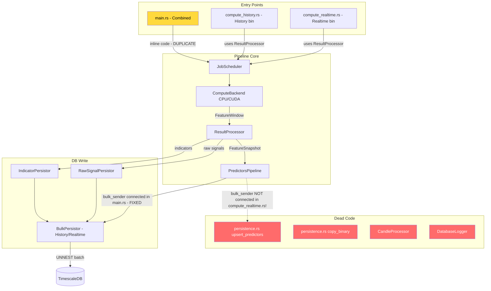

# Architecture Review: Rust_trader Project

**Author**: Claude (Architecture Audit)  
**Date**: 2026-02-15  
**Status**: Post-performance-fix review

---

## Executive Summary

The project has a **solid conceptual architecture** — the data flow is correct, the crate separation makes sense, and the core abstractions (ComputeBackend trait, BulkPersistor, Kafka-based events) are well-designed. However, there are significant **code duplication issues**, **dead/empty files**, and **missing wiring** that create tech debt and confusion. Below is a brutally honest assessment.

**Overall Score: 6/10** — Good bones, messy execution. Needs cleanup, not a rewrite.

---

## What's GOOD ✅

### 1. Crate Separation
The workspace layout is logical:
- `common/` — shared types, timeframes, message bus, sharding
- `connections/` — Binance API, WebSocket, Kafka, DB connections
- `database/` — DDL, bulk persistence, init
- `compute/` — indicators, raw signals, predictors, CUDA backend
- `cuda/` — CUDA kernels and Rust bindings

### 2. BulkPersistor Pattern
The `BulkPersistor` in `database/src/bulk_persistor.rs` is excellent:
- Two modes (History/Realtime) with different strategies
- UNNEST-based batch inserts (fastest PostgreSQL pattern)
- Symbol ID cache with `RwLock<HashMap>`
- Configurable via env vars
- Concurrent flush of signals/indicators/predictors via `tokio::join!`

### 3. ComputeBackend Trait
Clean trait abstraction with CPU/CUDA implementations and automatic fallback.

### 4. Feature Batch (Columnar Format)
`FeatureBatch` / `FeatureColumn` design is excellent — SoA layout matching the Manifesto.

### 5. Redpanda/Kafka Integration
Clean event-driven architecture with `candles.close` topic for realtime triggers.

---

## What's BAD ❌ (Duplications & Conflicts)

### 🔴 CRITICAL: Three Entry Points Doing the Same Thing

```
compute/src/main.rs          — 842 lines, inline pipeline setup
compute/src/bin/compute_history.rs  — 279 lines, uses ResultProcessor
compute/src/bin/compute_realtime.rs — 249 lines, uses ResultProcessor
```

**The problem**: `main.rs` duplicates ALL the logic from `ResultProcessor` inline (lines 176-430), building `IndicatorsWideRow`, processing raw signals, creating `FeatureSnapshot`, etc. Meanwhile `compute_history.rs` and `compute_realtime.rs` properly use `ResultProcessor`.

**Impact**: Any fix to the result processing logic needs to be applied in TWO places. The bug we just fixed (`bulk_sender` not connected) was present in `main.rs` AND `compute_realtime.rs` (line 91 — `set_bulk_sender` is NOT called there either!).

**Recommendation**: `main.rs` should use `ResultProcessor` like the bins do. The inline code should be deleted.

### 🔴 CRITICAL: compute_realtime.rs Still Missing bulk_sender

`compute/src/bin/compute_realtime.rs:91`:
```rust
predictors_pipeline.set_input_receiver(feature_rx);
// Missing: predictors_pipeline.set_bulk_sender(bulk_sender.clone());
```

This means the same slow-write bug we fixed in `main.rs` still exists in `compute_realtime.rs`.

### 🟡 MEDIUM: Duplicate Kafka Consumer Code

The Kafka consumer loop at `main.rs:719-841` is nearly identical to `compute_realtime.rs:118-241`.

**Recommendation**: Extract into a shared function in `common/` or a utility module.

### 🟡 MEDIUM: Duplicate `CandleCloseEvent` Struct

Defined independently in:
- `compute/src/main.rs:521-526`
- `compute/src/bin/compute_realtime.rs:244-249`

**Recommendation**: Move to `common/src/data_types.rs`.

### 🟡 MEDIUM: Duplicate `fetch_active_symbols_from_db`

Nearly identical implementations in:
- `compute/src/main.rs:529-572`
- `compute/src/bin/compute_history.rs:268-279`

**Recommendation**: Move to `common/` or `database/`.

### 🟡 MEDIUM: Three DB Write Approaches (Should Be One)

| Module | Approach | Used By |
|--------|----------|---------|
| `database/src/bulk_persistor.rs` | UNNEST batch inserts | main.rs, bins ✅ |
| `compute/predictors/src/persistence.rs::upsert_predictors()` | UNNEST (individual calls) | Fallback only ❌ |
| `compute/predictors/src/persistence.rs::copy_predictors_binary()` | COPY BINARY (tokio-postgres) | Never called! ❌ |

**Recommendation**: Keep only `BulkPersistor`. Delete `upsert_predictors()` or mark it as test-only fallback. If COPY BINARY is needed, integrate it into BulkPersistor as the History mode writer.

---

## Dead Code / Empty Files 💀

### 0-byte files (dead/placeholder):
| File | Status |
|------|--------|
| `compute/market_parameters/market_params_processsor.rs` | Empty, likely placeholder |
| `compute/planner/gpu_planner.rs` | Empty |
| `compute/planner/mod.rs` | Empty |
| `compute/scorer/mod.rs` | Empty (but `final_score.rs` is 12.9K!) |
| `compute/src/pools.rs` | Empty |
| `cuda/kernels/reduce.cu` | Empty |
| `cuda/ptx/indicators.ptx` | Empty (should be compiled from .cu) |
| `cuda/ptx/predictors.ptx` | Empty (should be compiled from .cu) |
| `cuda/src/predictors_kernel.rs` | 28 chars (just a comment?) |

### Near-empty files:
| File | Size | Content |
|------|------|---------|
| `compute/trade_signals/trade_signal_processor.rs` | 69 chars | Just a comment/stub |

### Unused modules:
| Module | Evidence |
|--------|----------|
| `common/src/processor.rs` (`CandleProcessor`) | Zero imports found anywhere in the project |
| `database/src/db_logger.rs` (`DatabaseLogger`) | Declared in `lib.rs` but never used by any consumer |

---

## CUDA Architecture Issues 🔧

### Missing `extern "C"` on consensus.cu
All 7 kernels in `cuda/kernels/consensus.cu` are missing `extern "C"`:
- `final_consensus_kernel`
- `check_rsi_divergence_kernel`
- `rsi_batch_kernel`
- `sma_batch_kernel`
- `ema_batch_kernel`
- `atr_batch_kernel`
- `raw_signals_combiner_kernel`

Without `extern "C"`, these kernels use C++ name mangling, making them unfindable by the `cudarc` Rust driver.

### Mixed `extern "C"` in indicators.cu
- **Newer** `_series` kernels (lines 7-650): Correctly use `extern "C"` ✅
- **Older** `_batch` and single-sample kernels (lines 659+): Missing `extern "C"` ❌

### CudaBackend Downloads Per-Indicator
In `cuda_backend.rs::compute_indicators()`, each indicator is downloaded separately:
```rust
let rsi_dev = ...calculate_rsi_batch(...)?;
let rsi_values = device.dtoh_sync_copy(&rsi_dev)?;  // Download #1
let sma_dev = ...calculate_sma_batch(...)?;
let sma_values = device.dtoh_sync_copy(&sma_dev)?;  // Download #2
// ... 12+ more downloads
```

True zero-copy would keep ALL indicators in GPU memory, then download them all in a single batched transfer. The `process_history_jobs_zero_copy` method attempts this but is never called.

---

## Architecture Flow (Current State)



---

## Recommended Cleanup Plan

### Phase 1: Fix Immediate Bugs
1. **Add `set_bulk_sender()` to `compute_realtime.rs:91`** — Same fix we applied to `main.rs`
2. **Add `extern "C"` to all `consensus.cu` kernels** — 7 kernels need annotation

### Phase 2: Eliminate Duplication
3. **Refactor `main.rs` to use `ResultProcessor`** — Delete inline 250+ lines of duplicate logic
4. **Extract shared `CandleCloseEvent` → `common/src/data_types.rs`**
5. **Extract shared `fetch_active_symbols_from_db` → `common/` or `database/`**
6. **Extract shared Kafka consumer loop → utility module**

### Phase 3: Delete Dead Code
7. Delete empty files: `pools.rs`, `gpu_planner.rs`, `planner/mod.rs`, `scorer/mod.rs`, `market_params_processsor.rs`, `reduce.cu`, `predictors_kernel.rs`
8. Mark `persistence.rs::upsert_predictors` as `#[cfg(test)]` only
9. Remove or integrate `copy_predictors_binary` into `BulkPersistor`
10. Remove `CandleProcessor` from `common/` (unused)

### Phase 4: CUDA True Zero-Copy
11. Add `extern "C"` to all remaining kernels in `indicators.cu` and `consensus.cu`
12. Implement batched download (all indicators in single transfer) in `CudaBackend::compute_indicators`
13. Wire `process_history_jobs_zero_copy` as the actual history processing path

---

## Verdict

**Is the architecture clean?** — The *design* is clean. The *implementation* has messy execution with significant duplication between `main.rs` and the bin files. The core patterns (BulkPersistor, ComputeBackend trait, FeatureBatch) are solid and well-thought-out.

**Is it "полное говно"?** — No. It's alpha-stage code that grew organically. The bones are good. About 10-15% of files are dead weight, and `main.rs` needs to stop duplicating `ResultProcessor`. The biggest bug was the missing `bulk_sender` wiring, which we fixed.

**What works well** — The 2-mode persistor architecture, the indicator system, the raw signal pipeline, the CUDA/CPU fallback pattern.

**What needs work** — Consolidating the 3 entry points, removing dead code, finishing the CUDA zero-copy pipeline, and consistent `extern "C"` annotations.
