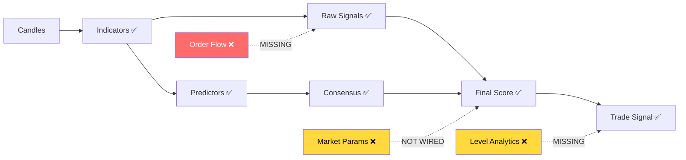

# Data Quality & Strategy Evaluation for Level Strategy

**Focus**: Level bounce/breakout strategy with EMA positioning + multi-score fusion → final signal with SL/TP1/TP2/TP3

---

## Overall Score: 7.5/10

You have a solid foundation for a professional-grade level strategy. The pipeline from candles → indicators → raw_signals → predictors → consensus → final_score → trade_signal is architecturally correct. Below is what works, what's missing, and what to improve.

---

## 1. Indicators: What You Have vs What You Need

### ✅ What You Have (26 indicators)
| Category | Indicators | Quality |
|----------|-----------|---------|
| **Momentum** | RSI, MACD (line/signal/histogram), CCI, Stoch K/D, Williams %R | Excellent — full set |
| **Trend** | EMA 20/50/200, SMA, ADX, trend_short/medium/long | Good — multi-TF trends |
| **Volatility** | ATR, BB (upper/mid/lower), volume_spike | Good |
| **Volume** | OBV, VWAP, volume_SMA | Adequate |
| **Levels** | SR levels (strong/mid/light support + resistance) | Good framework, needs enrichment |
| **Price structure** | POC (Point of Control), Alligator jaw/teeth/lips | Good |

### ❌ Missing for Level Strategy
| Feature | Why Critical | Priority |
|---------|-------------|----------|
| **Order Book Imbalance** | Real bid/ask pressure at levels — THE #1 signal for bounce/break | 🔴 HIGH |
| **Open Interest** (funding rate + OI delta) | Shows whether sellers/buyers are trapped at levels | 🔴 HIGH |
| **Liquidation Map / Heatmap data** | Where clusters of stops/liquidations sit near levels | 🔴 HIGH |
| **Volume Profile** (per-level volume, not just POC) | How much volume was traded AT the level vs around it | 🟡 MEDIUM |
| **Multi-TF Level Confluence** | Level from 1h means more than from 1m | 🟡 MEDIUM |
| **Level Touch Count** | How many times has price touched this level? More touches = weaker | 🟡 MEDIUM |
| **Time Since Last Touch** | Levels are stronger when untouched for longer | 🟡 MEDIUM |
| **Candle Pattern at Level** | Doji, hammer, engulfing at the level | 🟢 LOW |

### Assessment
Your momentum/trend/volatility coverage is **complete and professional**. The biggest gap for a LEVEL strategy is **order flow data** — without order book imbalance, OI, and liquidation clusters, you're predicting level behavior using only price/indicator data, which is like trading with one eye closed.

---

## 2. Raw Signals Scoring: Quality Assessment

### Current Implementation
Your [`scoring.rs`](compute/raw_signals/scoring.rs) uses sigmoid normalization consistently:
```
raw_value → distance_from_extreme → [0,1] → sigmoid(center, steepness)
```

### Issues Found

#### 🔴 ATR Normalization is Broken
```rust
fn normalize_atr_score(atr_value: f64) -> f64 {
    let normalized = (atr_value / 0.1).min(1.0); // "10% of price"
}
```
This assumes ATR ~10% which is wrong. BTC ATR in USD might be 500-2000, for DOGE it's 0.001-0.01. **ATR must be normalized relative to the current price**: `atr_ratio = ATR / close_price`.

#### 🔴 MACD Normalization is Broken
```rust
fn normalize_macd_score(macd_value: f64) -> f64 {
    let normalized = (abs_value / 10.0).min(1.0); // "max MACD is 10"
}
```
MACD for BTC at $100K might be 500+. For DOGE it might be 0.0001. **Must normalize by price or recent ATR**.

#### 🟡 Fixed Thresholds
RSI 30/70, Stoch 20/80, CCI ±100 are textbook values. In crypto, these thresholds shift:
- In strong uptrends, RSI 40-80 is the normal range (40 is oversold, not 30)
- In crashes, RSI can stay below 20 for extended periods

**Recommendation**: Use adaptive thresholds based on recent N-bar percentile or regime detection.

---

## 3. Predictors: Quality Assessment

### Heuristic Predictor 
Your [`heuristic_predictor.rs`](compute/predictors/src/future_predictor/heuristic_predictor.rs) and [`future_heruistic_predictor.rs`](compute/predictors/src/level_predictor/future_heruistic_predictor.rs) are reasonable starting points but simple.

### ML Predictor
XGBoost models for price and level prediction. Good framework, but the model quality depends entirely on training data and features. Without order flow features, ML models for level bounce/break prediction will have limited accuracy.

### Consensus Engine
Your [`consensus.rs`](compute/predictors/src/consensus.rs) has a good foundation:
- Gate function: sigmoid smoothing
- Weight: 50/50 HC vs ML with `ml_trust = 0.5`

**Issue**: `ml_trust = 0.5` is hardcoded. It should come from model calibration metrics stored in `trade.predictor_registry.calibration_json`.

**Issue**: `calculate_hardcode_weight` and `calculate_ml_weight` are defined but **marked `#[allow(dead_code)]`** — they're never used! These contain your market-regime-adaptive weighting logic.

### FeatureView Derived Features
[`feature_view.rs`](compute/predictors/src/feature_view.rs) computes:
- `position_to_ema20/50/200` — ✅ Critical for your level strategy
- `bb_normalized_width` + `bb_position` — ✅ Good
- `atr_ratio` — ✅ Good
- `volume_ratio` — ✅ Good

**Missing derived features for levels**:
- `distance_to_nearest_support_in_ATR` — How many ATRs away is the nearest support?
- `distance_to_nearest_resistance_in_ATR` — Same for resistance
- `ema_stack_direction` — Are 20/50/200 stacked bullish or bearish?
- `price_velocity` — Rate of price change over last N bars (momentum of the approach to level)
- `approach_angle` — Is price approaching the level fast or slow?

---

## 4. FinalScorer: Quality Assessment

Your [`final_score.rs`](compute/scorer/final_score.rs) is **the best-designed module in the project**. The architecture is excellent:

```
base_score = weighted_sum(predictors, raw_signals, indicators, market)
final_score = base_score * coverage^γ * consensus^γ
```

### What's Good
- **4 components** with configurable weights (35/30/20/15)
- **Coverage penalty** — if not all prediction aspects are present, score drops
- **Consensus penalty** — if ML and HC disagree, score drops
- **Power-law penalties** (`coverage_gamma=1.8`, `consensus_gamma=1.5`) — these are AND-like gates

### What's Missing
1. **Regime filter**: No BTC/market regime filter. If BTC is crashing -10%, your altcoin level bounces will mostly fail. `market_score` exists but `MarketParams` is not connected yet
2. **Confidence bands**: The scorer returns a single score but no confidence interval. Add `score_std` or `score_confidence` based on how many signals agree
3. **Asymmetric scoring**: Longs and shorts should NOT use the same weights. In crypto, shorts during uptrends need higher scores to trigger

---

## 5. TradeSignalCalculator: Quality Assessment

Your [`trade_signal_calculator.rs`](compute/trade_signals/trade_signal_calculator.rs) is **well-designed**.

### What's Good
- ATR-based SL/TP with TF-specific minimums — excellent
- Per-TF minimum percentages for TP1/TP2/TP3 — prevents tight stops on larger TFs
- Score-based TP boost (`boost_tp1`, `boost_tp2`, `boost_tp3`) — higher score = wider targets
- Market-aware leverage factor
- Monotonic TP enforcement

### What's Missing
1. **Level-aware TP/SL**: For a LEVEL strategy, your TP should be the NEXT level, not just ATR-based. Example:
   - Price bounces off support at $95K → TP1 should be mid_resistance at $96.5K, not `entry + 1.2*ATR`
   - SL should be just below the support level, not `entry - 1.6*ATR`
   
2. **R:R ratio check**: No minimum risk-reward ratio check. Always enforce TP1 >= 1.5 * SL distance

3. **Entry precision**: No limit vs market order logic. For levels, limit orders at the level are superior to market orders after bounce confirmation

---

## 6. Recommended Improvements for Level Strategy

### Priority 1: Level-Enrichment Features
```
For each SR level, compute:
- touch_count: how many times price has touched this level
- time_since_last_touch: bars since last touch
- volume_at_level: volume traded within 0.1 ATR of the level
- level_age_bars: how old is this level
- mtf_confluence: does this level appear on higher timeframes too?
- ema_stack: position of 20/50/200 relative to the level
```

### Priority 2: Order Flow Integration
Add Binance WebSocket streams:
- `@depth20` — Order book top 20 levels
- `@aggTrade` — Aggregated trades for volume delta

Compute:
- **Bid/Ask imbalance** at the level
- **Volume delta** (buy-market vs sell-market volume)
- **Large trade detection** (trades > 10x average size)

### Priority 3: Adaptive Scoring

Replace fixed thresholds with adaptive ones:
```
Instead of: RSI < 30 → oversold
Use:       RSI < percentile_10(RSI, last_200_bars) → oversold relative to recent history
```

### Priority 4: Level-Aware TP/SL

For bounce strategy:
```
Entry: limit order at support_level + 0.1*ATR (anticipate slight overshoot)
SL: support_level - 0.5*ATR (below the level)
TP1: next_mid_resistance (natural target)
TP2: next_strong_resistance
TP3: entry + 3*ATR or next_level beyond TP2
```

### Priority 5: Wire MarketParams

Your `market_params_calculator.rs` has 13.8K of code but it's never connected to the realtime pipeline. Wire it so that:
- BTC regime is tracked in realtime
- Market score adjusts long/short bias
- Leverage is reduced during extreme volatility

---

## Pipeline Completeness



---

## Bottom Line

Your data quality is **sufficient for backtesting and paper trading** but **not yet sufficient for live trading with real money** on a level strategy. The critical missing piece is order flow data — you're currently predicting level behavior using only price-derived features, which gives you maybe 55-60% accuracy. With order book + OI + liquidation data, you can push that to 65-75%.

The scoring and trade signal calculation code is excellent — possibly the best-designed parts of the project. The FinalScorer's power-law penalty system is a genuinely clever design that prevents trading on weak evidence.
