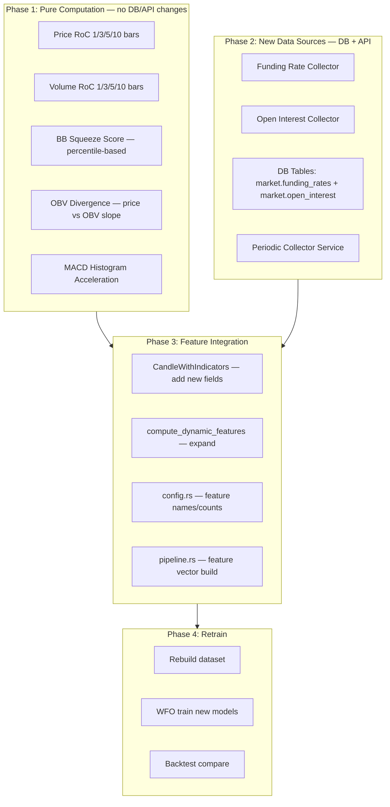

# План улучшения Direction и Super моделей — v2

## 1. Диагностика текущего состояния

### Direction модель — КРИТИЧЕСКИ слабая

Из WFO логов (`wfo_training_20260320_172423.log`):

| TF | Direction AUC OOS | Direction F1 OOS | Вердикт |
|----|-------------------|------------------|---------|
| 1m | 0.5201 ± 0.0429 | 0.5112 ± 0.0574 | ≈ рандом |
| 5m | 0.5605 ± 0.0207 | 0.5535 ± 0.0569 | чуть лучше рандома, trend↓ |
| 15m | 0.5064 ± 0.0269 | 0.5335 ± 0.0745 | ≈ рандом |
| 1h | 0.5030 ± 0.0343 | 0.5140 ± 0.0329 | ≈ рандом |
| 4h | 0.5337 ± 0.0276 | 0.5115 ± 0.0419 | чуть лучше рандома |
| 1d | 0.5306 ± 0.0445 | 0.4762 ± 0.0554 | ≈ рандом |

**Вывод**: Direction модель на ВСЕХ TF работает на уровне случайного подбрасывания монеты. Это главная причина убытков — бот определяет ЧТО будет движение, но НЕ ЗНАЕТ КУДА.

### Super модель — работает хорошо

| TF | Super AUC OOS | Super F1 OOS |
|----|--------------|--------------|
| 1m | 0.7624 | 0.6408 |
| 5m | 0.8059 | 0.5430 |
| 15m | 0.7415 | 0.5921 |
| 1h | 0.6802 | 0.6206 |

### Backtest (WR по TF)

| TF | Trades | WR | AvgPnL% |
|----|--------|-----|---------|
| 5m | 14839 | 28.3% | 0.32% |
| 15m | 66432 | 53.8% | 1.40% |
| 1h | 80197 | 65.5% | 2.46% |

**15m и 1h — целевые TF для улучшения.**

### Проблема с текущими фичами

Stable features для direction (из WFO):
- **5m**: `price_return_lb50`, `price_return_lb10`, `ema20_direction_lb10` — только price momentum
- **15m**: `macd_hist_slope_lb15`, `macd_norm` — только MACD
- **1h**: `trend_persist_lb10`, `rsi_slope_lb50` — только trend и RSI

**Критический дефицит**: модель НЕ видит:
1. **Скорость изменения** — всё статическое
2. **Volume dynamics** — volume_spike бинарен
3. **Volatility squeeze** — bb_width_pct есть, но нет percentile
4. **Market positioning** — funding rate, open interest вообще отсутствуют

---

## 2. Архитектура изменений



---

## 3. Детальный план по фазам

### Phase 1A: Price Rate-of-Change — в `compute_dynamic_features()`

**Файлы**: [`dataset.rs`](strategies/ml_entry_strategy/src/dataset.rs), [`config.rs`](strategies/ml_entry_strategy/src/config.rs)

Текущие `price_return_lb{N}` уже есть для N=3,5,10,15,25,50.
Но НЕТ коротких окон **1 бар** — это критично для momentum detection.

**Добавить фичи**:
```
price_roc_lb1     — (close[t] - close[t-1]) / close[t-1] * 100
price_roc_lb2     — (close[t] - close[t-2]) / close[t-2] * 100
price_accel_short — price_roc_lb1 - price_roc_lb1[t-1] = ускорение на 1 баре
price_accel_mid   — price_return_lb3 - price_return_lb3[t-3] = ускорение на 3 барах
```

**Почему lb1 критичен**: на 15m TF один бар = 15 мин. Разница между ценой 1 бар назад и 3 бара назад — это 15 мин vs 45 мин. Для краткосрочного моментума 1 бар — ключевой.

**Реализация**: добавить в `compute_dynamic_features()` в [`dataset.rs`](strategies/ml_entry_strategy/src/dataset.rs:193) перед aggregate секцией. Не требует lookback >1.

### Phase 1B: Volume Rate-of-Change

**Добавить фичи** — computed в `compute_dynamic_features()`:
```
volume_roc_lb1    — volume[t] / volume[t-1] - 1
volume_roc_lb3    — volume[t] / volume[t-3] - 1
volume_roc_lb5    — volume[t] / mean(volume[t-4..t]) - 1
volume_roc_lb10   — volume[t] / mean(volume[t-9..t]) - 1
volume_accel      — volume_roc_lb3 - volume_roc_lb3[t-3]
```

**Почему важно**: текущий `volume_spike` — бинарный ratio к SMA. Volume RoC покажет ТРЕНД в объёме: нарастающий объём 3 бара подряд vs одиночный спайк — совершенно разные сигналы.

### Phase 1C: BB Squeeze Score

**Добавить derived фичу** — computed в `derived_features()` и `pipeline.rs`:
```
bb_squeeze_score  — percentile(bb_width_pct, lookback=100)
                    0.0 = ширина BB в нижнем percentile = squeeze
                    1.0 = ширина BB в верхнем percentile = расширение
```

**Реализация**: Для derived_features() нужен lookback → перенести в `compute_dynamic_features()`.
Хранить ring buffer последних 100 значений `bb_width_pct` и считать percentile текущего значения.

**Почему критично**: BB Squeeze — один из надёжнейших предвестников сильного движения. Модель видит bb_width_pct, но НЕ знает что `bb_width_pct=0.5%` это squeeze если обычно `bb_width_pct=2%` на этом символе.

### Phase 2A: Funding Rate Collector

**Новые файлы**: 
- `connections/src/funding_collector.rs` — Binance API fetcher
- SQL миграция: `market.funding_rates` таблица

**Binance API**:
- Endpoint: `GET /fapi/v1/fundingRate?symbol=BTCUSDT&limit=100`
- Без аутентификации, rate limit 500 req/min
- Возвращает: `fundingTime`, `fundingRate`, `markPrice`
- Период funding: каждые 8 часов (00:00, 08:00, 16:00 UTC)

**DB Schema**:
```sql
CREATE TABLE market.funding_rates (
    time        TIMESTAMPTZ NOT NULL,
    symbol      TEXT NOT NULL,
    symbol_id   BIGINT NOT NULL,
    funding_rate FLOAT8 NOT NULL,
    mark_price  FLOAT8,
    PRIMARY KEY (time, symbol_id)
);
SELECT create_hypertable('market.funding_rates', 'time');
```

**Alternative — `/fapi/v1/premiumIndex`**:
- Уже есть `MarkPriceResponse` с `last_funding_rate` в [`binance_futures.rs`](connections/src/binance_futures.rs:136)
- Можно получить текущий funding для ВСЕХ символов за 1 запрос: `GET /fapi/v1/premiumIndex` (без symbol)
- Это проще: один запрос каждые 5 мин → batch insert

### Phase 2B: Open Interest Collector

**Binance API**:
- Endpoint: `GET /fapi/v1/openInterest?symbol=BTCUSDT`
- Без аутентификации
- Для исторических данных: `GET /futures/data/openInterestHist?symbol=BTCUSDT&period=5m&limit=500`
- Возвращает: `openInterest`, `sumOpenInterest`, `sumOpenInterestValue`

**DB Schema**:
```sql
CREATE TABLE market.open_interest (
    time        TIMESTAMPTZ NOT NULL,
    symbol      TEXT NOT NULL,
    symbol_id   BIGINT NOT NULL,
    open_interest FLOAT8 NOT NULL,
    oi_value_usd FLOAT8,
    PRIMARY KEY (time, symbol_id)
);
SELECT create_hypertable('market.open_interest', 'time');
```

### Phase 2C: Collector Service

Новый бинарник или extension к connections/src/main.rs:
- Каждые 5 минут: funding rate для всех активных пар (1 запрос `/fapi/v1/premiumIndex`)
- Каждые 5 минут: open interest для топ-50 пар (50 запросов, throttled)
- batch INSERT через UNNEST (как в манифесте)

### Phase 3A: Funding Rate интеграция в features

**Файлы**: [`dataset.rs`](strategies/ml_entry_strategy/src/dataset.rs), [`pipeline.rs`](strategies/ml_entry_strategy/src/pipeline.rs), [`config.rs`](strategies/ml_entry_strategy/src/config.rs)

1. Добавить поле `funding_rate: f64` в `CandleWithIndicators`
2. SQL join: `LEFT JOIN market.funding_rates fr ON fr.symbol_id = p.symbol_id AND fr.time <= c.time ORDER BY fr.time DESC LIMIT 1`
3. Derived фичи:
   ```
   funding_rate_raw      — последний funding rate (может быть 0.01% = нормально, -0.1% = экстремально)
   funding_rate_norm     — funding_rate / 0.001 (нормализация к базовому 0.1%)
   funding_rate_extreme  — |funding_rate| > 3 * mean(|funding_rate| за 7 дней)
   funding_rate_sign     — sign(funding_rate): +1 = лонги доминируют, -1 = шорты
   ```

### Phase 3B: Open Interest интеграция

1. Добавить `open_interest: f64`, `oi_change_pct: f64` в `CandleWithIndicators`
2. Dynamic фичи:
   ```
   oi_change_lb1     — OI(t) / OI(t-1) - 1
   oi_change_lb3     — OI(t) / OI(t-3) - 1
   oi_price_regime   — sign(oi_change) * sign(price_change) → 4 режима закодированы в [-1,1]
   ```

### Phase 4: OBV Divergence + MACD Acceleration — Secondary Priority

**OBV Divergence** — в `compute_dynamic_features()`:
```
obv_divergence_lb10 — corr(price_returns, obv_returns, window=10)
                      Если корреляция < 0 = дивергенция
```

**MACD Acceleration** — расширение существующих `macd_hist_slope`:
```
macd_hist_roc_lb1 — macd_hist[t] - macd_hist[t-1]
macd_hist_roc_lb3 — macd_hist[t] - macd_hist[t-3]
macd_hist_accel   — macd_hist_roc_lb1 - macd_hist_roc_lb1[t-1]
```

### Phase 5: config.rs Update

В [`config.rs`](strategies/ml_entry_strategy/src/config.rs:257):

**Новые DYNAMIC_FEATURES** (добавить в конец массива):
```rust
// Phase 1A: Price RoC
"price_roc_lb1", "price_roc_lb2", "price_accel_short", "price_accel_mid",
// Phase 1B: Volume RoC
"volume_roc_lb1", "volume_roc_lb3", "volume_roc_lb5", "volume_roc_lb10", "volume_accel",
// Phase 1C: BB Squeeze
"bb_squeeze_score",
// Phase 4: OBV Divergence + MACD Acceleration
"obv_divergence_lb10", "macd_hist_roc_lb1", "macd_hist_roc_lb3", "macd_hist_accel",
```

**Новые фичи от Funding/OI** (отдельная секция, т.к. из внешних данных):
```rust
// Phase 3A: Funding Rate
"funding_rate_raw", "funding_rate_norm", "funding_rate_extreme", "funding_rate_sign",
// Phase 3B: Open Interest
"oi_change_lb1", "oi_change_lb3", "oi_price_regime",
```

**Итого новых фич**: 4 + 5 + 1 + 4 + 4 + 3 = **21 новая фича**
Текущее: 106 фич → Новое: **127 фич**

### Phase 6: Python WFO Trainer Update

В [`train_super_entry_wfo.py`](trainer/src/train_super_entry_wfo.py):
- Feature columns list обновляется автоматически из CSV header
- Убедиться что NaN обработка корректна для funding/OI (могут быть None для исторических данных)
- Добавить imputation: funding_rate=0.0001 (default), open_interest=median

### Phase 7-8: Rebuild и валидация

1. `cargo run --release -p ml_entry_strategy --bin super_entry_dataset`
2. `python trainer/src/train_super_entry_wfo.py --gpu --timeframes 5,15,60`
3. `cargo run --release -p ml_entry_strategy --bin super_entry_backtest`
4. Сравнить Direction AUC по TF 5m/15m/1h — цель: AUC > 0.58

---

## 4. Порядок имплементации — приоритет по ROI

### Batch 1 — Maximum ROI, minimal effort — PURE COMPUTATION

Не требует API/DB изменений — всё считается из OHLCV:

1. **Price RoC lb1/lb2 + acceleration** — 4 фичи
2. **Volume RoC lb1/3/5/10 + acceleration** — 5 фич
3. **BB Squeeze percentile** — 1 фича
4. **MACD histogram acceleration** — 3 фичи
5. **OBV divergence** — 1 фича

**Итого**: 14 новых фич, все через `compute_dynamic_features()`.
**Estimated impact**: Direction AUC +3-8% на 15m/1h.

### Batch 2 — External data — REQUIRES API + DB

Требует создания коллектора и DB таблиц:

1. **Funding Rate** — 4 фичи + API + DB table
2. **Open Interest** — 3 фичи + API + DB table

**Estimated impact**: Direction AUC +2-5% дополнительно.

---

## 5. Критические замечания по архитектуре

### Не забыть про обратную совместимость
- Feature count изменится 106 → 127+
- Старые .ubj модели НЕ будут работать с новыми фичами
- Нужно или версионировать модели (`super_entry_v2_tf{X}.ubj`) или перетренировать все
- WFO тренер автоматически возьмёт новый набор из CSV — OK

### Warmup для BB Squeeze
- BB Squeeze percentile нужен lookback 100 баров  
- Текущий `max_dynamic_lookback() = 50`
- Нужно увеличить до 100: `DYNAMIC_LOOKBACK_WINDOWS` не затрагивается, but `max_dynamic_lookback()` should return 100 for squeeze

### Funding Rate для исторических данных
- Binance API даёт funding history: `GET /fapi/v1/fundingRate?limit=1000`
- Нужно backfill минимум 30 дней для WFO
- Для 15m/1h TF — funding обновляется каждые 8h, значит на 15m свече 32 бара будут иметь один и тот же funding
- Это OK: модель научится что funding rate — медленно меняющийся сигнал

### Open Interest granularity
- OI endpoint даёт только текущий snapshot
- Historical OI: `/futures/data/openInterestHist` с period=5m,15m,30m,1h,2h,4h,6h,12h,1d
- Для 5m/15m TF нужен period=5m → rate limited, но за 30 дней = 8640 точек на символ
- Для backfill: по 50 символов × 500 запросов = 25000 запросов (≈50 мин при 10 req/sec)

---

## 6. Как изменения затронут каждый файл

| Файл | Изменения |
|------|-----------|
| `config.rs` | +21 feature name в DYNAMIC/DERIVED, bump total_feature_count |
| `dataset.rs` | `CandleWithIndicators` +2 поля, `compute_dynamic_features()` +14 фич, `full_features()` update |
| `pipeline.rs` | `process_candles()` — добавить запись новых фич в `features_flat` |
| `binance_futures.rs` | `+fetch_all_premium_index()`, `+fetch_open_interest()` |
| `connections/src/` | Новый файл: `funding_oi_collector.rs` |
| SQL migrations | 2 новые таблицы: `market.funding_rates`, `market.open_interest` |
| `train_super_entry_wfo.py` | Автоматически подхватит из CSV, but need NaN handling |
| `backtest.rs` | SQL запрос обновить для JOIN funding/OI |
| `service.rs` | Добавить funding/OI фичи при realtime inference |
