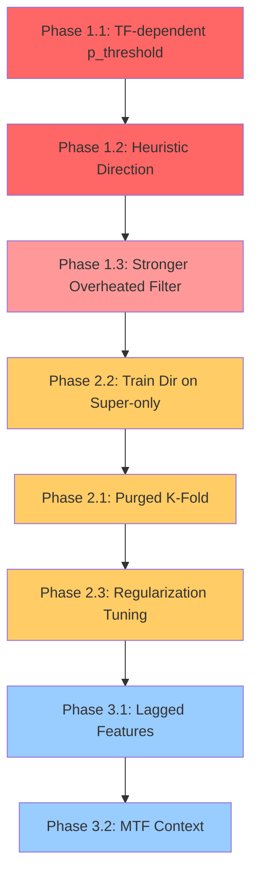

# Super Entry Strategy — План Улучшения WinRate

## Диагностика

### Текущие результаты (time-series split + min_dir=0.02)
| TF | Trades | WR% | PnL% | Cover% |
|----|--------|-----|------|--------|
| 15m | 262,214 | 36.9% | 0.58% | 22.4% |
| 1h | 186,626 | 44.5% | 0.84% | 20.2% |
| 4h | 142,732 | 47.7% | 1.26% | 26.0% |

### Старые результаты (pair-split, data leakage)
| TF | Trades | WR% | PnL% | Cover% |
|----|--------|-----|------|--------|
| 15m | 17,565 | 54.8% | 1.57% | 1.25% |
| 1h | 46,495 | 67.6% | 2.65% | 4.17% |
| 4h | 17,092 | 67.0% | 3.63% | 2.75% |

### Реальная торговля
- 1h: ~50% WR — совпадает с новым бэктестом (44.5%), а не старым (67.6%)
- Это подтверждает: **pair-split давал утечку данных**, time-series split показывает реальную картину

### Корневые проблемы

```
                    ПРОБЛЕМА 1: Модель СЛИШКОМ ВКЛЮЧАЮЩАЯ
                    ─────────────────────────────────────
                    p_threshold = 0.55 пропускает 262K трейдов на 15m
                    Старая система: 17.5K на 15m — в 15 раз меньше
                    Нужна СЕЛЕКТИВНОСТЬ, не количество
```

```
                    ПРОБЛЕМА 2: Direction модель = РАНДОМ
                    ─────────────────────────────────────
                    AUC ~0.50 на всех TF с time-series split
                    Направление предсказывается не лучше монеты
                    Попытка предсказать LONG/SHORT из snapshot — не работает
```

```
                    ПРОБЛЕМА 3: Калибровка P(super) слабая
                    ──────────────────────────────────────
                    1h: p_super 0.70-0.80 даёт всего 49% WR
                    Должно быть: p=0.70 → ~70% WR
                    Модель переуверенна в слабых сигналах
```

### Анализ P(SUPER) Bucket — ключ к решению
```
TF      0.55-0.60  0.60-0.70  0.70-0.80  0.80-0.90  0.90+
15m     27%(41K)   33%(82K)   40%(80K)   46%(59K)   50%(2)
1h      38%(40K)   44%(84K)   49%(62K)   77%(176)     -
4h      43%(35K)   48%(91K)   53%(16K)   56%(713)   100%(1)
```
**Вывод**: Только p_super > 0.80 даёт приемлемый WR на 1h (77%), но на 4h даже 0.90 даёт только 56%.

---

## Phase 1: Quick Wins — Повышение Селективности

### 1.1 Поднять p_threshold (TF-зависимый)
Вместо единого p_threshold=0.55, использовать per-TF пороги:

| TF | Текущий | Новый | Ожидаемый WR | Ожидаемые Trades |
|----|---------|-------|-------------|------------------|
| 15m | 0.55 | 0.70 | ~40-45% | ~80K |
| 1h | 0.55 | 0.75 | ~49-55% | ~62K |
| 4h | 0.55 | 0.65 | ~48-53% | ~107K |

**Файлы**: `config.rs` — добавить `tf_p_thresholds`, `scorer.rs` — использовать per-TF threshold

### 1.2 Убрать Direction из критического пути
Сейчас direction модель определяет сторону сделки. С AUC=0.50 это рандом.

**Предложение**: Заменить ML-direction на **heuristic direction** на основе тренда:
```
direction = if trend > 0 AND ema_20 > ema_50 -> LONG
            if trend < 0 AND ema_20 < ema_50 -> SHORT
            else -> SKIP (не торговать)
```
Это уже заложено в данных — `trend` и `trend_short` индикаторы.

**Файлы**: `scorer.rs` — новый метод `determine_direction_heuristic()`, `pipeline.rs` — передать trend данные

### 1.3 Усилить Overheated фильтр
Текущий overheated блокирует только при 2+ extreme readings.
- Снизить до 1 extreme reading для marginally-above-threshold сигналов
- Добавить ATR-based filter: не торговать при atr_pct < 0.5% (нет волатильности для TP)

---

## Phase 2: Улучшение Обучения

### 2.1 Purged Group TimeSeriesSplit
Вместо простого 80/20 time split, использовать K фолдов с gap:
```python
from sklearn.model_selection import TimeSeriesSplit

# 5 фолдов, gap = 50 свечей (чтобы нет data leakage)
tscv = TimeSeriesSplit(n_splits=5, gap=50)
```
Это даёт больше данных для тренировки и более стабильную оценку.

### 2.2 Тренировать Direction ТОЛЬКО на Super-примерах
Ключевая идея: direction model сейчас учится на ВСЕХ данных (и super и не-super).
На не-super данных направление шумное. Если тренировать ТОЛЬКО на is_super=True:
- Меньше шума
- Направление при super-move обычно более выраженное
- Модель может лучше различать LONG vs SHORT среди сильных движений

```python
# Для direction модели — фильтруем только super примеры
super_only = tf_df[tf_df["is_super"] == 1].copy()
train_super, test_super = split_by_time(super_only, 0.8)
```

### 2.3 Увеличить Регуляризацию
```python
params = {
    "lambda": 5.0,        # L2 regularization (было default 1.0)
    "alpha": 1.0,         # L1 regularization (было default 0.0)
    "min_child_weight": 10,  # Минимум примеров в листе (было 5)
    "gamma": 0.5,         # Minimum loss reduction to split
    "max_depth": 5,       # Shallow trees (было 6)
    "num_boost_round": 1000,  # Больше раундов (было 500)
    "early_stopping_rounds": 50,  # (было 30)
}
```

---

## Phase 3: Feature Engineering

### 3.1 Lagged Features (изменения индикаторов)
Текущие фичи — snapshot одного момента. Не хватает ДИНАМИКИ:
```rust
// Добавить в dataset.rs:
// RSI change за последние 5 баров
let rsi_change_5 = candles[t].rsi - candles[t-5].rsi;
// ATR change (расширение/сжатие волатильности)
let atr_change_5 = (candles[t].atr - candles[t-5].atr) / candles[t-5].atr;
// Volume trend (растёт/падает)
let vol_ratio_5 = candles[t].volume / avg_volume_5;
```

### 3.2 Multi-Timeframe Context (MTF)
Для 15m торговли: учитывать состояние 1h и 4h:
```
15m trade + 1h_trend=UP + 4h_trend=UP → stronger signal
15m trade + 1h_trend=DOWN → weaker signal
```
Требует хранения MTF индикаторов в pipeline.

### 3.3 Market Regime Features
- BTC 24h return (бычий/медвежий рынок)
- Funding rate (если доступен)
- Implied volatility proxy

---

## Приоритет Реализации



Красные = немедленный эффект, Жёлтые = средний, Синие = долгосрочные
