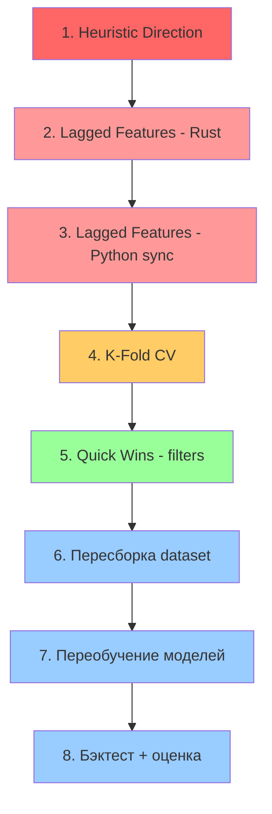

# Super Entry — Winrate Improvements v2: Детальный План Реализации

## Обзор Изменений

Три основных блока + quick wins для повышения WR с текущих 37-48% до целевых 50-55%:

| # | Изменение | Эффект | Риск |
|---|-----------|--------|------|
| 1.2 | Heuristic Direction | Убираем рандомную модель direction AUC=0.50 | Низкий |
| 3.1 | Lagged Features | Добавляем динамику индикаторов для лучшей модели | Средний |
| 2.1 | K-Fold TimeSeriesSplit | Более стабильная оценка, больше данных для обучения | Низкий |
| QW | ATR min + overheated | Фильтрация слабых/перегретых сигналов | Низкий |

**CRITICAL**: Lagged features меняют feature count 59 → 65. Модели ОБЯЗАТЕЛЬНО переобучить.

---

## Порядок реализации



---

## 1. Heuristic Direction (scorer.rs, pipeline.rs, config.rs)

### Проблема
Direction модель `super_dir_v1_tfX.ubj` даёт AUC=0.50 — это рандом. Сейчас она определяет LONG/SHORT для каждого сигнала. С рандомным выбором стороны мы теряем ~50% трейдов.

### Решение
Заменить ML-direction на heuristic на основе trend индикаторов, которые уже есть в данных:

```
direction = match (trend, trend_short, ema_20, ema_50):
    if trend > 0 AND ema_20 > ema_50 -> LONG
    if trend < 0 AND ema_20 < ema_50 -> SHORT
    else -> SKIP (не торговать)
```

### Файлы для изменений

#### `config.rs` — добавить флаг
```rust
pub struct SuperEntryConfig {
    // ... existing ...
    /// Use heuristic direction instead of ML direction model.
    /// Heuristic: trend + EMA crossover.
    pub use_heuristic_direction: bool,
}
// Default: true (ML direction не работает)
// Env: SUPER_ENTRY_HEURISTIC_DIR=true
```

#### `scorer.rs` — новая структура + метод
```rust
/// Context for heuristic direction decision
pub struct DirectionContext {
    pub trend: f64,
    pub trend_short: f64,
    pub ema_20: f64,
    pub ema_50: f64,
    pub supertrend_dir: f64,
}

impl DirectionContext {
    /// Determine direction by heuristic.
    /// Returns Some(1) for LONG, Some(-1) for SHORT, None for SKIP.
    pub fn heuristic_direction(&self) -> Option<i8> {
        let trend_long = self.trend > 0.0 && self.ema_20 > self.ema_50;
        let trend_short = self.trend < 0.0 && self.ema_20 < self.ema_50;

        if trend_long { Some(1) }
        else if trend_short { Some(-1) }
        else { None } // SKIP — нет чёткого тренда
    }
}
```

Изменить метод `score()` — добавить `direction_ctx: Option<&DirectionContext>`:
- Если `use_heuristic_direction=true` и есть `DirectionContext`:
  - Вызвать `heuristic_direction()`
  - Если `None` → `NoSignal { reason: NoTrend }`
  - Если `Some(dir)` → использовать `dir` вместо `prediction.direction`
- Если `use_heuristic_direction=false`:
  - Старая логика через ML direction model

#### `pipeline.rs` — передать context
В `process_candles` и `process_single`:
- Извлечь `trend`, `ema_20`, `ema_50` из `CandleWithIndicators`
- Создать `DirectionContext`
- Передать в `scorer.score()`

### Тесты
- Проверить: trend=+1, ema20 > ema50 → LONG
- Проверить: trend=-1, ema20 < ema50 → SHORT
- Проверить: trend=0 → SKIP (NoSignal)
- Проверить: trend=+1 но ema20 < ema50 → SKIP (конфликт)

---

## 2. Lagged Features (dataset.rs, config.rs, pipeline.rs)

### Проблема
Текущие 59 фичей — это snapshot одного момента. Модель не видит ДИНАМИКУ: растёт RSI или падает, расширяется волатильность или сжимается, растёт объём или падает.

### Новые фичи (6 штук, lookback=5 баров)

| Имя фичи | Формула | Что показывает |
|-----------|---------|----------------|
| `rsi_change_5` | rsi[t] - rsi[t-5] | Направление импульса |
| `atr_change_5` | (atr[t] - atr[t-5]) / atr[t-5] | Волатильность расширяется/сжимается |
| `vol_ratio_5` | volume[t] / avg(volume[t-4..=t]) | Относительный объём |
| `macd_hist_change_5` | macd_hist[t] - macd_hist[t-5] | Ускорение моментума |
| `adx_change_5` | adx[t] - adx[t-5] | Усиление/ослабление тренда |
| `price_momentum_norm` | (close[t]-close[t-5])/close[t-5]*100/atr_pct | Нормализованный моментум |

### Файлы для изменений

#### `config.rs` — новая категория фичей
```rust
/// Lagged features computed from candle history window
pub const LAGGED_FEATURES: &[&str] = &[
    "rsi_change_5",
    "atr_change_5",
    "vol_ratio_5",
    "macd_hist_change_5",
    "adx_change_5",
    "price_momentum_norm",
];

pub const LAGGED_LOOKBACK: usize = 5;

/// Total = INDICATOR (35) + DERIVED (24) + LAGGED (6) = 65
pub fn total_feature_count() -> usize {
    INDICATOR_FEATURES.len() + DERIVED_FEATURES.len() + LAGGED_FEATURES.len()
}
```

#### `dataset.rs` — вычисление lagged features

Новая функция:
```rust
/// Compute lagged features from candle history window.
/// Requires at least `lookback + 1` candles ending at index `t`.
/// Returns Vec of lagged feature values in LAGGED_FEATURES order.
pub fn compute_lagged_features(
    candles: &[CandleWithIndicators],
    t: usize,
    lookback: usize,
) -> Vec<f64> {
    let safe_div = |a: f64, b: f64| if b.abs() > 1e-12 { a / b } else { 0.0 };
    
    if t < lookback {
        // Not enough history — return zeros
        return vec![0.0; crate::config::LAGGED_FEATURES.len()];
    }
    
    let cur = &candles[t];
    let prev = &candles[t - lookback];
    
    let rsi_change_5 = cur.rsi - prev.rsi;
    let atr_change_5 = safe_div(cur.atr - prev.atr, prev.atr);
    
    // Average volume over last 5 bars
    let avg_vol: f64 = candles[t.saturating_sub(lookback-1)..=t]
        .iter()
        .map(|c| c.volume)
        .sum::<f64>() / lookback as f64;
    let vol_ratio_5 = safe_div(cur.volume, avg_vol);
    
    let macd_hist_change_5 = cur.macd_hist - prev.macd_hist;
    let adx_change_5 = cur.adx - prev.adx;
    
    let close_change_pct = safe_div(cur.close - prev.close, prev.close) * 100.0;
    let atr_pct = safe_div(cur.atr, cur.close) * 100.0;
    let price_momentum_norm = safe_div(close_change_pct, atr_pct.max(0.01));
    
    vec![
        rsi_change_5,
        atr_change_5,
        vol_ratio_5,
        macd_hist_change_5,
        adx_change_5,
        price_momentum_norm,
    ]
}
```

В `build_labels()`:
- Изменить `start_idx` на `start_idx.max(LAGGED_LOOKBACK)` для гарантии истории
- После `candles[t].full_features()` добавить `features.extend(compute_lagged_features(candles, t, LAGGED_LOOKBACK))`

В `all_feature_names()`:
```rust
pub fn all_feature_names() -> Vec<&'static str> {
    let mut names: Vec<&str> = INDICATOR_FEATURES.to_vec();
    names.extend_from_slice(DERIVED_FEATURES);
    names.extend_from_slice(LAGGED_FEATURES);  // NEW
    names
}
```

#### `pipeline.rs` — вычисление lagged features при inference

В `process_candles`:
```rust
// After derived features, add lagged features (6 features)
let lagged = if i >= 5 {
    compute_lagged_features_f32(candles, i, 5)
} else {
    vec![0.0f32; LAGGED_FEATURES.len()]
};
features_flat.extend_from_slice(&lagged);
```

Нужна f32-версия `compute_lagged_features` для zero-copy пути.

В `process_single`:
- Изменить сигнатуру: принимать `lookback: Option<&[CandleWithIndicators]>`
- Если lookback доступен — вычислить lagged features
- Если нет — использовать нули (graceful degradation)

#### `super_entry_stage.rs` — буферизация для RT

В REALTIME режиме `SuperEntryStage` уже буферизирует для HISTORY. Для единичных свечей нужно:
- Хранить последние 5 свечей для каждой пары (symbol, tf) в `HashMap`
- Передавать их как lookback в `process_single`

### Тесты
- Unit test: `compute_lagged_features` с known данными
- Проверка длины feature vector = 65
- Проверка что при t < 5 возвращаются нули

---

## 3. K-Fold TimeSeriesSplit (train_super_entry.py)

### Проблема
Текущий 80/20 time split:
- Использует только 80% данных для обучения
- Одна точка оценки — нестабильно
- Gap не задан — возможен data leakage на границе split

### Решение
```python
from sklearn.model_selection import TimeSeriesSplit

def train_with_kfold(tf_df, feature_cols, label_col, use_gpu, model_name, n_splits=5, gap=50):
    tscv = TimeSeriesSplit(n_splits=n_splits, gap=gap)
    tf_df_sorted = tf_df.sort_values('timestamp').reset_index(drop=True)
    
    fold_metrics = []
    best_model = None
    best_auc = 0.0
    
    for fold, (train_idx, test_idx) in enumerate(tscv.split(tf_df_sorted)):
        train_df = tf_df_sorted.iloc[train_idx]
        test_df = tf_df_sorted.iloc[test_idx]
        
        model, metrics = train_binary(train_df, test_df, label_col, feature_cols, use_gpu, 
                                       f'{model_name} fold{fold}')
        fold_metrics.append(metrics)
        
        if metrics['auc'] > best_auc:
            best_auc = metrics['auc']
            best_model = model
    
    # Report average metrics across folds
    avg_auc = np.mean([m['auc'] for m in fold_metrics])
    std_auc = np.std([m['auc'] for m in fold_metrics])
    print(f'  K-Fold AUC: {avg_auc:.4f} ± {std_auc:.4f}')
    
    return best_model, fold_metrics[-1]  # Use last fold metrics for final model
```

### Синхронизация LAGGED_FEATURES
```python
LAGGED_FEATURES = [
    "rsi_change_5",
    "atr_change_5",
    "vol_ratio_5",
    "macd_hist_change_5",
    "adx_change_5",
    "price_momentum_norm",
]

ALL_FEATURES = INDICATOR_FEATURES + DERIVED_FEATURES + LAGGED_FEATURES
```

---

## 4. Quick Wins — Дополнительные фильтры (scorer.rs)

### 4.1 ATR Minimum Filter
```rust
// В OverheatedFeatures::is_overheated() или отдельный метод
if self.atr_pct < 0.3 {
    // Волатильность слишком мала — TP не будет достигнут
    return RejectReason::LowVolatility;
}
```

### 4.2 Усиленный Overheated фильтр
```rust
// Добавить в OverheatedFeatures поля:
pub adx: f64,
pub trend: f64,
pub trend_short: f64,

// Trend exhaustion: если trend вытянут слишком далеко
// trend > +3.0 и пытаемся LONG — конец движения
fn is_trend_exhausted(&self, direction: i8) -> bool {
    if direction == 1 && self.trend > 3.0 && self.trend_short > 2.0 {
        true  // Тренд перетянут для LONG
    } else if direction == -1 && self.trend < -3.0 && self.trend_short < -2.0 {
        true  // Тренд перетянут для SHORT
    } else {
        false    
    }
}
```

### 4.3 Новый RejectReason
```rust
pub enum RejectReason {
    BelowThreshold,
    WeakDirection,
    Overheated,
    LowVolatility,   // NEW: ATR too low
    NoTrend,          // NEW: Conflicting trend signals
    TrendExhausted,   // NEW: End of move
}
```

---

## Порядок действий для разработчика

### Шаг 1: Heuristic Direction (без ретренинга)
1. `config.rs` — add `use_heuristic_direction: bool` + env var
2. `scorer.rs` — add `DirectionContext`, `RejectReason::NoTrend`, update `score()`
3. `pipeline.rs` — pass `DirectionContext` to scorer
4. Тесты — unit tests для heuristic direction

### Шаг 2: Quick Wins (без ретренинга)
5. `scorer.rs` — add `RejectReason::LowVolatility`, `TrendExhausted`
6. `scorer.rs` — update `OverheatedFeatures` с новыми полями + проверками
7. `pipeline.rs` — передать новые поля в `OverheatedFeatures`

### Шаг 3: Lagged Features (требует ретренинг)
8. `config.rs` — add `LAGGED_FEATURES`, `LAGGED_LOOKBACK`, update `total_feature_count`
9. `dataset.rs` — add `compute_lagged_features()`, integrate into `build_labels`, update `all_feature_names`
10. `pipeline.rs` — compute lagged features in `process_candles` and `process_single`
11. `super_entry_stage.rs` — RT lookback buffer

### Шаг 4: Python Trainer
12. `train_super_entry.py` — add `LAGGED_FEATURES`, update `ALL_FEATURES`
13. `train_super_entry.py` — implement K-Fold TimeSeriesSplit

### Шаг 5: Build + Train + Test
14. `cargo run --release -p ml_entry_strategy --bin super_entry_dataset`
15. `python trainer/src/train_super_entry.py --gpu`
16. Бэктест + сравнение WR/PnL

---

## Ожидаемый Эффект

| Изменение | Ожидаемый эффект на WR |
|-----------|----------------------|
| Heuristic Direction | +3-5% WR (убираем рандомный direction model) |
| ATR min filter | +1-2% WR (отсеиваем trades без волы) |
| Trend exhaustion | +1-2% WR (не входим в конце движения) |
| Lagged Features | +2-4% WR (модель видит динамику) |
| K-Fold CV | Стабильнее метрики, чуть лучше generalization |
| **СУММАРНО** | **+7-13% WR** (целевой: 50-55% для всех TF) |

## Риски

1. **Feature count mismatch** — Rust и Python ДОЛЖНЫ иметь идентичный список фичей. Любое расхождение → NaN в моделях.
2. **Lagged features в RT** — Нужна буферизация. Первые 5 свечей после запуска будут с нулевыми lagged features.
3. **SKIP в heuristic direction** — Значительно снизит количество трейдов. Это OK если WR растёт.
4. **Regression** — Обязательно сравнить metrics до/после через полный бэктест.
